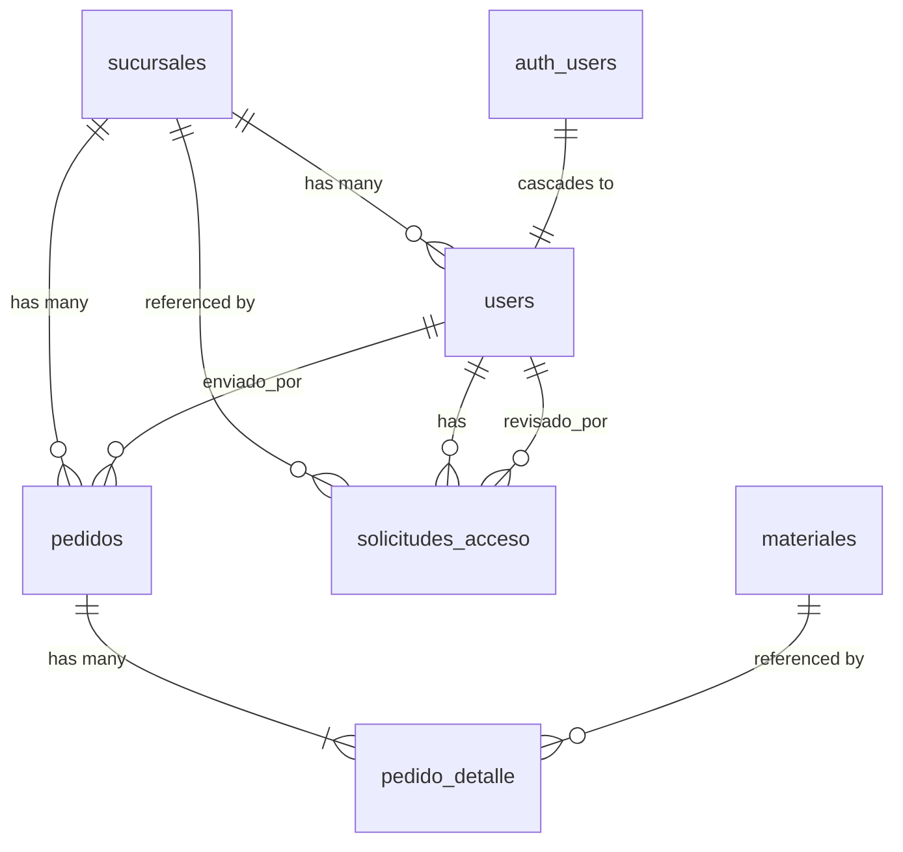

## Overview

CEDIS Pedidos uses PostgreSQL with Supabase, featuring 6 core tables with Row Level Security (RLS) policies. The schema supports multi-branch ordering with granular access control.

## Enums

### categoria_enum

Material category types:

- `materia_prima` - Raw materials (40 items)
- `esencia` - Fragrances/essences (82 items)
- `varios` - Miscellaneous items (21 items)
- `envase_vacio` - Empty containers (14 items)
- `color` - Colors/pigments (11 items)

### rol_enum

User role types:

- `admin` - Administrator with full system access
- `sucursal` - Branch user with restricted access

### estado_pedido

Order status workflow:

- `borrador` - Draft (editable by branch)
- `enviado` - Submitted (awaiting approval)
- `aprobado` - Approved (awaiting printing)
- `impreso` - Printed (order fulfilled)

---

## Tables

### sucursales

Branch/location information for the organization.

<ParamField path="id" type="uuid" required>
  Primary key, auto-generated with `gen_random_uuid()`
</ParamField>

<ParamField path="nombre" type="text" required>
  Full branch name (e.g., "Pachuca I", "Guadalajara")
</ParamField>

<ParamField path="abreviacion" type="text" required>
  Unique short code for the branch (e.g., "PAC1", "GDL", "CDMX")
  
  **Constraint:** UNIQUE
</ParamField>

<ParamField path="ciudad" type="text" required>
  City where the branch is located
</ParamField>

<ParamField path="activa" type="boolean" default="true">
  Whether the branch is currently active
</ParamField>

<Note>
  **RLS Policy:** All authenticated users can read all branches (`sucursales_select`)
</Note>

#### Seed Data

```sql
INSERT INTO sucursales (nombre, abreviacion, ciudad) VALUES
  ('Pachuca I',   'PAC1', 'Pachuca'),
  ('Guadalajara', 'GDL',  'Guadalajara'),
  ('CDMX Norte',  'CDMX', 'Ciudad de México');
```

---

### users

User profiles linked to Supabase Auth with role-based access control.

<ParamField path="id" type="uuid" required>
  Primary key, references `auth.users(id)` ON DELETE CASCADE
</ParamField>

<ParamField path="nombre" type="text" required>
  User's full name
</ParamField>

<ParamField path="email" type="text" required>
  User's email address
  
  **Constraint:** UNIQUE
</ParamField>

<ParamField path="rol" type="rol_enum" required>
  User role: `admin` or `sucursal`
</ParamField>

<ParamField path="sucursal_id" type="uuid">
  Foreign key to `sucursales(id)` ON DELETE SET NULL
  
  Required for `sucursal` role users, NULL for admins
</ParamField>

<ParamField path="estado_cuenta" type="text" default="activo">
  Account status: `pendiente`, `activo`, or `inactivo`
  
  **Constraint:** CHECK IN ('pendiente','activo','inactivo')
</ParamField>

<ParamField path="es_superadmin" type="boolean" default="false">
  Flag for super administrator privileges
</ParamField>

<Note>
  **RLS Policies:**
  - Users can read their own profile
  - Admins can read all profiles
  - Users can insert/update their own profile
</Note>

---

### materiales

Catalog of all materials available for ordering (168 total items).

<ParamField path="id" type="uuid" required>
  Primary key, auto-generated with `gen_random_uuid()`
</ParamField>

<ParamField path="codigo" type="text">
  Optional material code (legacy identifier)
  
  **Constraint:** UNIQUE
</ParamField>

<ParamField path="nombre" type="text" required>
  Material name (e.g., "Aceite De Pino", "Lavanda Francesa")
</ParamField>

<ParamField path="categoria" type="categoria_enum" required>
  Category: `materia_prima`, `esencia`, `varios`, `envase_vacio`, or `color`
</ParamField>

<ParamField path="unidad_base" type="text" default="kgs">
  Base unit of measurement (e.g., "kgs", "Lt", "Pzas", "Paquete")
</ParamField>

<ParamField path="peso_aproximado" type="numeric">
  Approximate weight/quantity per container
</ParamField>

<ParamField path="envase" type="text">
  Container description (e.g., "200lts", "25kgs", "Caja")
</ParamField>

<ParamField path="orden" type="integer" required>
  Display order within category
</ParamField>

<Note>
  **RLS Policy:** All authenticated users can read all materials (`materiales_select`)
</Note>

#### Material Counts by Category

- **Materias Primas:** 40 items
- **Esencias:** 82 items
- **Varios:** 21 items
- **Envases Vacíos:** 14 items
- **Colores:** 11 items
- **Total:** 168 materials

---

### pedidos

Order headers containing delivery date, status, and metadata.

<ParamField path="id" type="uuid" required>
  Primary key, auto-generated with `gen_random_uuid()`
</ParamField>

<ParamField path="codigo_pedido" type="text" required>
  Human-readable order code (e.g., "PAC1-2026-001")
  
  **Constraint:** UNIQUE
</ParamField>

<ParamField path="sucursal_id" type="uuid" required>
  Foreign key to `sucursales(id)`, identifies which branch placed the order
</ParamField>

<ParamField path="fecha_entrega" type="date" required>
  Requested delivery date
</ParamField>

<ParamField path="total_kilos" type="numeric" default="0">
  Total weight/quantity sum from `pedido_detalle`
  
  **Business rule:** Must be < 13,000 kgs (validated by `validate_pedido_limit` function)
</ParamField>

<ParamField path="estado" type="estado_pedido" default="borrador">
  Order status: `borrador`, `enviado`, `aprobado`, or `impreso`
</ParamField>

<ParamField path="created_at" type="timestamptz" default="now()">
  Order creation timestamp
</ParamField>

<ParamField path="updated_at" type="timestamptz" default="now()">
  Last update timestamp (auto-updated via trigger)
</ParamField>

<ParamField path="enviado_at" type="timestamptz">
  Timestamp when order was submitted (status changed to `enviado`)
</ParamField>

<ParamField path="enviado_por" type="uuid">
  Foreign key to `users(id)`, user who submitted the order
</ParamField>

#### Indexes

```sql
CREATE INDEX idx_pedidos_sucursal  ON pedidos(sucursal_id);
CREATE INDEX idx_pedidos_estado    ON pedidos(estado);
CREATE INDEX idx_pedidos_fecha     ON pedidos(fecha_entrega);
```

#### Triggers

**Auto-update `updated_at`:**

```sql
CREATE TRIGGER trg_pedidos_updated_at
  BEFORE UPDATE ON pedidos
  FOR EACH ROW EXECUTE FUNCTION update_updated_at();
```

<Note>
  **RLS Policies:** See [Row Level Security](/database/row-level-security#pedidos-policies)
</Note>

---

### pedido_detalle

Order line items linking orders to materials with quantities.

<ParamField path="id" type="uuid" required>
  Primary key, auto-generated with `gen_random_uuid()`
</ParamField>

<ParamField path="pedido_id" type="uuid" required>
  Foreign key to `pedidos(id)` ON DELETE CASCADE
</ParamField>

<ParamField path="material_id" type="uuid" required>
  Foreign key to `materiales(id)`
</ParamField>

<ParamField path="cantidad_kilos" type="numeric">
  Quantity in kilograms (used for materials measured in kgs)
</ParamField>

<ParamField path="cantidad_solicitada" type="numeric">
  Requested quantity (used for piece-based materials)
</ParamField>

<ParamField path="peso_total" type="numeric">
  Total weight for this line item
</ParamField>

<ParamField path="lote" type="text">
  Batch/lot number (filled by admin during fulfillment)
</ParamField>

<ParamField path="peso" type="numeric">
  Actual weight (filled by admin during fulfillment)
</ParamField>

**Constraint:** UNIQUE(pedido_id, material_id) - one row per material per order

#### Indexes

```sql
CREATE INDEX idx_detalle_pedido    ON pedido_detalle(pedido_id);
CREATE INDEX idx_detalle_material  ON pedido_detalle(material_id);
```

<Note>
  **RLS Policies:** Access follows parent `pedidos` table rules. See [Row Level Security](/database/row-level-security#pedido_detalle-policies)
</Note>

---

### solicitudes_acceso

Access requests for new user registration (approval workflow).

<ParamField path="id" type="uuid" required>
  Primary key, auto-generated with `gen_random_uuid()`
</ParamField>

<ParamField path="user_id" type="uuid">
  Foreign key to `users(id)` ON DELETE CASCADE (set after account creation)
</ParamField>

<ParamField path="nombre" type="text" required>
  Requester's full name
</ParamField>

<ParamField path="email" type="text" required>
  Requester's email address
</ParamField>

<ParamField path="sucursal_id" type="uuid">
  Foreign key to `sucursales(id)`, requested branch assignment
</ParamField>

<ParamField path="mensaje" type="text">
  Optional message from requester
</ParamField>

<ParamField path="estado" type="text" default="pendiente">
  Request status: `pendiente`, `aprobado`, or `rechazado`
  
  **Constraint:** CHECK IN ('pendiente','aprobado','rechazado')
</ParamField>

<ParamField path="revisado_por" type="uuid">
  Foreign key to `users(id)`, admin who reviewed the request
</ParamField>

<ParamField path="revisado_at" type="timestamptz">
  Timestamp when request was reviewed
</ParamField>

<ParamField path="created_at" type="timestamptz" default="now()">
  Request creation timestamp
</ParamField>

<Note>
  **RLS Policies:**
  - Any authenticated user can insert
  - Users can read their own requests
  - Admins can read and update all requests
</Note>

---

## Database Functions

### validate_pedido_limit(p_pedido_id uuid)

Validates that an order's total weight is under 13,000 kgs.

**Returns:** `boolean`

**Usage:**
```sql
SELECT validate_pedido_limit('order-uuid-here');
```

**Implementation:**
```sql
CREATE OR REPLACE FUNCTION validate_pedido_limit(p_pedido_id uuid)
RETURNS boolean LANGUAGE sql SECURITY DEFINER AS $$
  SELECT COALESCE(total_kilos, 0) < 13000
  FROM pedidos WHERE id = p_pedido_id;
$$;
```

---

## Relationships



### Key Relationships

1. **sucursales → users**: One branch has many users (ON DELETE SET NULL)
2. **sucursales → pedidos**: One branch has many orders
3. **pedidos → pedido_detalle**: One order has many line items (ON DELETE CASCADE)
4. **materiales → pedido_detalle**: One material appears in many line items
5. **auth.users → users**: One-to-one with CASCADE delete
6. **users → solicitudes_acceso**: User can have multiple access requests

---

## TypeScript Interfaces

See `/workspace/source/src/lib/types.ts` for complete type definitions:

```typescript
export interface Sucursal {
    id: string
    nombre: string
    abreviacion: string
    ciudad: string
    activa: boolean
}

export interface UserProfile {
    id: string
    nombre: string
    email: string
    rol: Rol
    sucursal_id: string | null
    sucursal?: Sucursal
    estado_cuenta: EstadoCuenta
    es_superadmin: boolean
}

export interface Material {
    id: string
    codigo: string | null
    nombre: string
    categoria: Categoria
    unidad_base: string
    peso_aproximado: number | null
    envase: string | null
    orden: number
    activo: boolean
}

export interface Pedido {
    id: string
    codigo_pedido: string
    sucursal_id: string
    fecha_entrega: string
    tipo_entrega: TipoEntrega | null
    total_kilos: number
    estado: EstadoPedido
    created_at: string
    updated_at: string
    enviado_at: string | null
    enviado_por: string | null
    sucursal?: Sucursal
}

export interface PedidoDetalle {
    id: string
    pedido_id: string
    material_id: string
    cantidad_kilos: number | null
    cantidad_solicitada: number | null
    peso_total: number | null
    lote: string | null
    peso: number | null
    material?: Material
}
```
