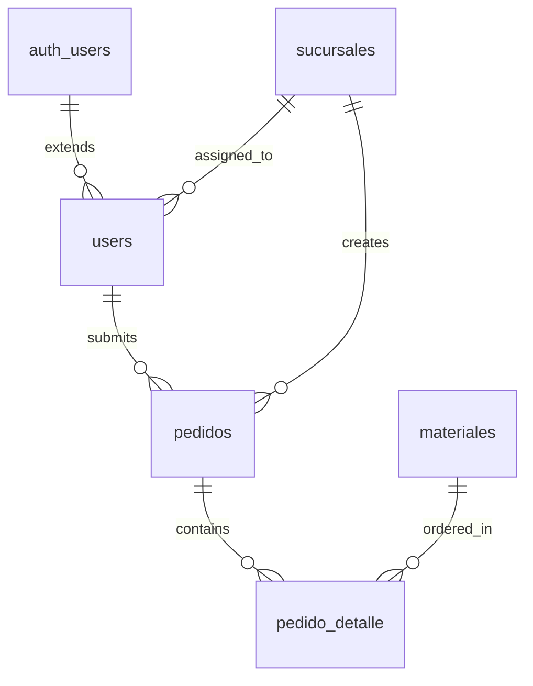

## Overview

CEDIS Pedidos uses Supabase as its backend platform, providing PostgreSQL database, authentication, and real-time capabilities. This guide walks you through setting up a complete Supabase project with the required schema and security policies.

## Prerequisites

- A Supabase account ([sign up here](https://app.supabase.com))
- Basic understanding of PostgreSQL and SQL
- Access to the Supabase SQL Editor

## Project Setup

<Steps>
  <Step title="Create a new Supabase project">
    1. Log in to your [Supabase dashboard](https://app.supabase.com)
    2. Click **New Project**
    3. Enter your project details:
       - **Name**: CEDIS Pedidos (or your preferred name)
       - **Database Password**: Strong password (save this securely)
       - **Region**: Choose the closest region to your users
       - **Pricing Plan**: Select based on your needs (Free tier works for development)
    4. Click **Create new project**

    <Note>
    Project creation takes 1-2 minutes. Supabase will provision a PostgreSQL database and set up authentication services.
    </Note>
  </Step>

  <Step title="Access the SQL Editor">
    Once your project is ready:
    1. Navigate to **SQL Editor** in the left sidebar
    2. Click **New Query** to create a new SQL script
    3. You'll use this editor to run the database schema
  </Step>

  <Step title="Run the database schema">
    Copy and paste the complete schema from the section below into the SQL Editor, then click **Run** to execute.

    <Warning>
    Running this schema will create tables, policies, and seed data. Only run this on a fresh project or ensure you understand the implications for existing data.
    </Warning>
  </Step>
</Steps>

## Database Schema

The CEDIS Pedidos database consists of five main tables with strict Row Level Security policies:

### Schema Overview



### Complete Schema SQL

Execute this complete SQL script in your Supabase SQL Editor:

```sql schema.sql
-- ═══════════════════════════════════════════════════════════════
-- CEDIS Pedidos — Database Schema & Seed
-- ═══════════════════════════════════════════════════════════════

-- ─────────────────────────────────────────────
-- 1. ENUMS
-- ─────────────────────────────────────────────
CREATE TYPE categoria_enum AS ENUM (
  'materia_prima', 'esencia', 'varios', 'envase_vacio', 'color'
);
CREATE TYPE rol_enum AS ENUM ('admin', 'sucursal');
CREATE TYPE estado_pedido AS ENUM ('borrador', 'enviado', 'aprobado', 'impreso');

-- ─────────────────────────────────────────────
-- 2. TABLES
-- ─────────────────────────────────────────────

CREATE TABLE sucursales (
  id          uuid PRIMARY KEY DEFAULT gen_random_uuid(),
  nombre      text NOT NULL,
  abreviacion text UNIQUE NOT NULL,
  ciudad      text NOT NULL,
  activa      boolean NOT NULL DEFAULT true
);

CREATE TABLE users (
  id          uuid PRIMARY KEY REFERENCES auth.users ON DELETE CASCADE,
  nombre      text NOT NULL,
  email       text UNIQUE NOT NULL,
  rol         rol_enum NOT NULL,
  sucursal_id uuid REFERENCES sucursales(id) ON DELETE SET NULL
);

CREATE TABLE materiales (
  id               uuid PRIMARY KEY DEFAULT gen_random_uuid(),
  codigo           text UNIQUE,
  nombre           text NOT NULL,
  categoria        categoria_enum NOT NULL,
  unidad_base      text NOT NULL DEFAULT 'kgs',
  peso_aproximado  numeric,
  envase           text,
  orden            integer NOT NULL
);

CREATE TABLE pedidos (
  id             uuid PRIMARY KEY DEFAULT gen_random_uuid(),
  codigo_pedido  text UNIQUE NOT NULL,
  sucursal_id    uuid NOT NULL REFERENCES sucursales(id),
  fecha_entrega  date NOT NULL,
  total_kilos    numeric NOT NULL DEFAULT 0,
  estado         estado_pedido NOT NULL DEFAULT 'borrador',
  created_at     timestamptz NOT NULL DEFAULT now(),
  updated_at     timestamptz NOT NULL DEFAULT now(),
  enviado_at     timestamptz,
  enviado_por    uuid REFERENCES users(id)
);

CREATE TABLE pedido_detalle (
  id                  uuid PRIMARY KEY DEFAULT gen_random_uuid(),
  pedido_id           uuid NOT NULL REFERENCES pedidos(id) ON DELETE CASCADE,
  material_id         uuid NOT NULL REFERENCES materiales(id),
  cantidad_kilos      numeric,
  cantidad_solicitada numeric,
  peso_total          numeric,
  lote                text,
  peso                numeric,
  UNIQUE (pedido_id, material_id)
);

-- ─────────────────────────────────────────────
-- 3. INDEXES
-- ─────────────────────────────────────────────
CREATE INDEX idx_pedidos_sucursal  ON pedidos(sucursal_id);
CREATE INDEX idx_pedidos_estado    ON pedidos(estado);
CREATE INDEX idx_pedidos_fecha     ON pedidos(fecha_entrega);
CREATE INDEX idx_detalle_pedido    ON pedido_detalle(pedido_id);
CREATE INDEX idx_detalle_material  ON pedido_detalle(material_id);

-- ─────────────────────────────────────────────
-- 4. updated_at trigger
-- ─────────────────────────────────────────────
CREATE OR REPLACE FUNCTION update_updated_at()
RETURNS TRIGGER LANGUAGE plpgsql AS $$
BEGIN
  NEW.updated_at = now();
  RETURN NEW;
END;
$$;

CREATE TRIGGER trg_pedidos_updated_at
  BEFORE UPDATE ON pedidos
  FOR EACH ROW EXECUTE FUNCTION update_updated_at();

-- ─────────────────────────────────────────────
-- 5. RPC: validate 13,000 kg limit
-- ─────────────────────────────────────────────
CREATE OR REPLACE FUNCTION validate_pedido_limit(p_pedido_id uuid)
RETURNS boolean LANGUAGE sql SECURITY DEFINER AS $$
  SELECT COALESCE(total_kilos, 0) < 13000
  FROM pedidos WHERE id = p_pedido_id;
$$;

-- ─────────────────────────────────────────────
-- 6. ROW LEVEL SECURITY
-- ─────────────────────────────────────────────
ALTER TABLE sucursales    ENABLE ROW LEVEL SECURITY;
ALTER TABLE users         ENABLE ROW LEVEL SECURITY;
ALTER TABLE materiales    ENABLE ROW LEVEL SECURITY;
ALTER TABLE pedidos       ENABLE ROW LEVEL SECURITY;
ALTER TABLE pedido_detalle ENABLE ROW LEVEL SECURITY;

-- sucursales: all authenticated users can read
CREATE POLICY "sucursales_select" ON sucursales FOR SELECT USING (auth.role() = 'authenticated');

-- users: can read own row; admin reads all
CREATE POLICY "users_select" ON users FOR SELECT
  USING (id = auth.uid() OR EXISTS (SELECT 1 FROM users WHERE id = auth.uid() AND rol = 'admin'));
CREATE POLICY "users_insert" ON users FOR INSERT WITH CHECK (id = auth.uid());
CREATE POLICY "users_update" ON users FOR UPDATE USING (id = auth.uid());

-- materiales: authenticated read
CREATE POLICY "materiales_select" ON materiales FOR SELECT USING (auth.role() = 'authenticated');

-- pedidos: sucursal sees own; admin sees all
CREATE POLICY "pedidos_select" ON pedidos FOR SELECT USING (
  EXISTS (SELECT 1 FROM users WHERE id = auth.uid() AND rol = 'admin')
  OR sucursal_id = (SELECT sucursal_id FROM users WHERE id = auth.uid())
);
CREATE POLICY "pedidos_insert" ON pedidos FOR INSERT WITH CHECK (
  sucursal_id = (SELECT sucursal_id FROM users WHERE id = auth.uid())
);
CREATE POLICY "pedidos_update_sucursal" ON pedidos FOR UPDATE USING (
  estado = 'borrador'
  AND sucursal_id = (SELECT sucursal_id FROM users WHERE id = auth.uid())
) WITH CHECK (
  sucursal_id = (SELECT sucursal_id FROM users WHERE id = auth.uid())
);
CREATE POLICY "pedidos_update_admin" ON pedidos FOR UPDATE USING (
  EXISTS (SELECT 1 FROM users WHERE id = auth.uid() AND rol = 'admin')
);
CREATE POLICY "pedidos_delete_sucursal" ON pedidos FOR DELETE USING (
  estado = 'borrador'
  AND sucursal_id = (SELECT sucursal_id FROM users WHERE id = auth.uid())
);

-- pedido_detalle: follow parent pedido rules
CREATE POLICY "detalle_select" ON pedido_detalle FOR SELECT USING (
  EXISTS (
    SELECT 1 FROM pedidos p
    WHERE p.id = pedido_id AND (
      EXISTS (SELECT 1 FROM users WHERE id = auth.uid() AND rol = 'admin')
      OR p.sucursal_id = (SELECT sucursal_id FROM users WHERE id = auth.uid())
    )
  )
);
CREATE POLICY "detalle_insert" ON pedido_detalle FOR INSERT WITH CHECK (
  EXISTS (
    SELECT 1 FROM pedidos p
    WHERE p.id = pedido_id
      AND p.estado = 'borrador'
      AND p.sucursal_id = (SELECT sucursal_id FROM users WHERE id = auth.uid())
  )
);
CREATE POLICY "detalle_update" ON pedido_detalle FOR UPDATE USING (
  EXISTS (
    SELECT 1 FROM pedidos p
    WHERE p.id = pedido_id
      AND p.estado = 'borrador'
      AND p.sucursal_id = (SELECT sucursal_id FROM users WHERE id = auth.uid())
  )
);
CREATE POLICY "detalle_delete" ON pedido_detalle FOR DELETE USING (
  EXISTS (
    SELECT 1 FROM pedidos p
    WHERE p.id = pedido_id
      AND p.estado = 'borrador'
      AND p.sucursal_id = (SELECT sucursal_id FROM users WHERE id = auth.uid())
  )
);
CREATE POLICY "detalle_insert_admin" ON pedido_detalle FOR INSERT WITH CHECK (
  EXISTS (SELECT 1 FROM users WHERE id = auth.uid() AND rol = 'admin')
);
CREATE POLICY "detalle_update_admin" ON pedido_detalle FOR UPDATE USING (
  EXISTS (SELECT 1 FROM users WHERE id = auth.uid() AND rol = 'admin')
);
CREATE POLICY "detalle_delete_admin" ON pedido_detalle FOR DELETE USING (
  EXISTS (SELECT 1 FROM users WHERE id = auth.uid() AND rol = 'admin')
);

-- ─────────────────────────────────────────────
-- 7. SEED: Sucursales
-- ─────────────────────────────────────────────
INSERT INTO sucursales (nombre, abreviacion, ciudad) VALUES
  ('Pachuca I',   'PAC1', 'Pachuca'),
  ('Guadalajara', 'GDL',  'Guadalajara'),
  ('CDMX Norte',  'CDMX', 'Ciudad de México');
```

<Note>
The schema includes seed data for 3 branches (sucursales) and 168 materials across 5 categories. The complete materials seed data is included in the full `schema.sql` file.
</Note>

## Row Level Security (RLS) Explained

RLS is the core security mechanism that protects data in CEDIS Pedidos:

### Security Model

<CodeGroup>
```sql Sucursales (Branches)
-- All authenticated users can read branches
CREATE POLICY "sucursales_select" ON sucursales 
  FOR SELECT USING (auth.role() = 'authenticated');
```

```sql Users
-- Users can read their own data; admins can read all
CREATE POLICY "users_select" ON users FOR SELECT
  USING (
    id = auth.uid() 
    OR EXISTS (SELECT 1 FROM users WHERE id = auth.uid() AND rol = 'admin')
  );
```

```sql Orders (Pedidos)
-- Branches see only their orders; admins see all
CREATE POLICY "pedidos_select" ON pedidos FOR SELECT USING (
  EXISTS (SELECT 1 FROM users WHERE id = auth.uid() AND rol = 'admin')
  OR sucursal_id = (SELECT sucursal_id FROM users WHERE id = auth.uid())
);

-- Branches can only update draft orders
CREATE POLICY "pedidos_update_sucursal" ON pedidos FOR UPDATE USING (
  estado = 'borrador'
  AND sucursal_id = (SELECT sucursal_id FROM users WHERE id = auth.uid())
);
```
</CodeGroup>

### Key Security Features

1. **Branch Isolation**: Each sucursal can only see and modify their own orders
2. **Admin Privileges**: Admin users have full read/write access across all data
3. **Draft Protection**: Only draft orders can be modified by branches
4. **Cascade Security**: Order details (`pedido_detalle`) inherit security from parent orders
5. **Weight Validation**: RPC function validates 13,000 kg weight limit

<Warning>
**Critical Security Notes**

- Never disable RLS on production tables
- Test policies thoroughly before deploying
- Admins have elevated permissions - assign this role carefully
- The `anon` key is safe for client use only because RLS is enabled
</Warning>

## Authentication Setup

<Steps>
  <Step title="Configure authentication providers">
    Navigate to **Authentication** → **Providers** in your Supabase dashboard.

    For CEDIS Pedidos, configure:
    - **Email**: Enable email/password authentication
    - Disable social providers (not required for this application)
  </Step>

  <Step title="Configure email templates">
    Go to **Authentication** → **Email Templates** to customize:
    - Confirmation emails
    - Password reset emails
    - Change email confirmation

    Update the sender name and email address to match your organization.
  </Step>

  <Step title="Create user accounts">
    Users can be created through:

    <CodeGroup>
    ```sql SQL Editor (Manual)
    -- First create a user in Supabase Auth
    -- Then add to the users table
    INSERT INTO users (id, nombre, email, rol, sucursal_id)
    VALUES (
      'auth-user-uuid',
      'Juan Pérez',
      'juan@example.com',
      'sucursal',
      (SELECT id FROM sucursales WHERE abreviacion = 'PAC1')
    );
    ```

    ```typescript Admin Panel
    // Through the application's admin panel
    // Admins can create and manage users
    ```
    </CodeGroup>
  </Step>
</Steps>

## Database Indexes

The schema includes optimized indexes for common queries:

```sql
CREATE INDEX idx_pedidos_sucursal  ON pedidos(sucursal_id);
CREATE INDEX idx_pedidos_estado    ON pedidos(estado);
CREATE INDEX idx_pedidos_fecha     ON pedidos(fecha_entrega);
CREATE INDEX idx_detalle_pedido    ON pedido_detalle(pedido_id);
CREATE INDEX idx_detalle_material  ON pedido_detalle(material_id);
```

These indexes optimize:
- Filtering orders by branch
- Filtering orders by status (borrador, enviado, aprobado, impreso)
- Filtering orders by delivery date
- Joining order details with orders
- Looking up materials in orders

## Seeded Data

The schema includes initial data:

### Branches (Sucursales)

| Name | Abbreviation | City |
|------|--------------|------|
| Pachuca I | PAC1 | Pachuca |
| Guadalajara | GDL | Guadalajara |
| CDMX Norte | CDMX | Ciudad de México |

### Materials (Materiales)

The schema seeds 168 materials across 5 categories:
- **Materias Primas** (Raw Materials): 40 items
- **Esencias** (Fragrances): 82 items
- **Varios** (Miscellaneous): 21 items
- **Envases Vacíos** (Empty Containers): 14 items
- **Colores** (Colors): 11 items

## Testing Your Setup

<Steps>
  <Step title="Verify tables exist">
    Run this query in the SQL Editor:

    ```sql
    SELECT table_name FROM information_schema.tables
    WHERE table_schema = 'public'
    ORDER BY table_name;
    ```

    You should see: `materiales`, `pedido_detalle`, `pedidos`, `sucursales`, `users`
  </Step>

  <Step title="Check seed data">
    Verify branches and materials were seeded:

    ```sql
    SELECT COUNT(*) as branch_count FROM sucursales;
    SELECT COUNT(*) as material_count FROM materiales;
    ```

    Expected results: 3 branches, 168 materials
  </Step>

  <Step title="Test RLS policies">
    Create a test user and verify they can only access authorized data according to the RLS policies.
  </Step>
</Steps>

## Troubleshooting

### Schema Execution Errors

**Error**: `type "categoria_enum" already exists`

**Solution**: The enum types already exist. Either drop them first or skip the enum creation statements.

### RLS Policy Conflicts

**Error**: `policy "policy_name" already exists`

**Solution**: Drop existing policies before recreating:
```sql
DROP POLICY IF EXISTS "policy_name" ON table_name;
```

### Connection Issues

**Error**: Cannot connect from application

**Solution**:
- Verify your `VITE_SUPABASE_URL` and `VITE_SUPABASE_ANON_KEY` are correct
- Check that RLS is enabled on all tables
- Ensure your project is not paused (free tier projects pause after inactivity)

## Next Steps

With your Supabase project configured:

1. [Deploy to Vercel](/deployment/vercel-deployment) - Deploy your application to production
2. Create admin and branch user accounts through Supabase Auth
3. Test the complete application flow from order creation to approval
