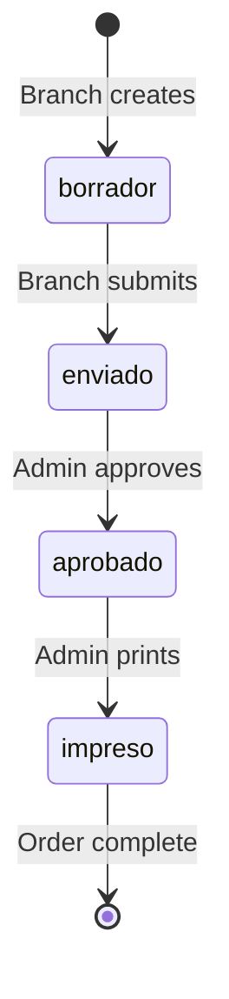

Administrators oversee all branch orders, manage approvals, and track fulfillment across the entire distribution center.

## Dashboard Overview

The admin dashboard provides real-time metrics and order management:

### Key Statistics

Four stat cards display:

<CardGroup cols={2}>
  <Card title="Pedidos Hoy" icon="package" color="#1E3A6E">
    Orders with today's delivery date
  </Card>
  <Card title="Total Enviados" icon="clock" color="#F59E0B">
    Orders awaiting admin review
  </Card>
  <Card title="Aprobados" icon="check-circle" color="#10B981">
    Orders ready for printing
  </Card>
  <Card title="Toneladas Totales" icon="chart-line" color="#3B82F6">
    Total tonnage scheduled this week
  </Card>
</CardGroup>

### Order Table Filters

Filter orders by:

- **Sucursal**: Select specific branch or view all
- **Estado**: Filter by order state (all, borrador, enviado, aprobado, impreso)

## Reviewing Orders

<Steps>
  <Step title="Access Dashboard">
    Navigate to **Dashboard** from the sidebar to see the comprehensive order list.
  </Step>

  <Step title="Identify Pending Orders">
    Orders in `enviado` state appear with an amber badge:
    
    <Info>
      **● Enviado** - These orders require your review and approval
    </Info>
    
    The table shows:
    - Order code (`PAC1-20260305`)
    - Branch name
    - Delivery date
    - Delivery type (HINO or Recolección)
    - Total weight in kg
    - Submission timestamp
  </Step>

  <Step title="Preview Order Details">
    Click the **eye icon** to preview the printable fulfillment format inline.
    
    This shows the complete material breakdown with:
    - All requested materials by category
    - Quantities in kilograms
    - Empty container requirements
    - Order metadata
  </Step>

  <Step title="Edit if Needed">
    Click the **pencil icon** to open the order in edit mode.
    
    <Warning>
      Admins can edit orders in any state, unlike branch users who can only edit drafts.
    </Warning>
    
    Make adjustments to quantities, delivery dates, or other details as needed.
  </Step>

  <Step title="Approve Order">
    For orders in `enviado` state, click the **Aprobar** button.
    
    This changes the order state to `aprobado` and makes it ready for the print/fulfillment phase.
  </Step>
</Steps>

## Managing Order States

Admins control the order lifecycle through state transitions:

### State Transition Flow

### Admin Actions by State

<Tabs>
  <Tab title="Borrador">
    **Draft orders** created by branches but not yet submitted.
    
    **Admin capabilities:**
    - View and edit
    - No approval action needed (branch still working)
  </Tab>
  
  <Tab title="Enviado">
    **Submitted orders** awaiting review.
    
    **Admin capabilities:**
    - Preview printable format
    - Edit if corrections needed
    - **Aprobar** button to move to next stage
    
    <Info>
      This is the primary review state - validate quantities, delivery dates, and material availability.
    </Info>
  </Tab>
  
  <Tab title="Aprobado">
    **Approved orders** ready for fulfillment.
    
    **Admin capabilities:**
    - Export PDF format
    - **Imprimir** button to mark as printed
    - Edit if late changes required
  </Tab>
  
  <Tab title="Impreso">
    **Printed orders** in fulfillment process.
    
    **Admin capabilities:**
    - View final details
    - Edit if critical changes needed
    - Track completion
  </Tab>
</Tabs>

## Printing Fulfillment Formats

<Steps>
  <Step title="Identify Approved Orders">
    Look for orders with the **● Aprobado** badge (green with emerald color).
  </Step>

  <Step title="Preview Format">
    Click the **eye icon** to see the fulfillment format (Formato de Surtido - Hoja 2).
    
    This shows the warehouse picking list with all materials organized by category.
  </Step>

  <Step title="Export PDF">
    From the preview pane, click **↓ Exportar PDF** or open the print view.
    
    The format includes:
    - Order header (code, branch, dates)
    - Material breakdown by category
    - Empty container requirements
    - Signatures section for receiving
  </Step>

  <Step title="Mark as Printed">
    After printing, click the **Imprimir** button to change state to `impreso`.
    
    This signals the order is in active fulfillment.
  </Step>
</Steps>

## User & Access Management

Switch to the **Solicitudes & Usuarios** tab to:

### Review Access Requests

New users submit access requests that appear with pending count:

<Info>
  **Solicitudes & Usuarios** badge shows pending request count
</Info>

For each request, see:
- User name and email
- Requested branch assignment
- Optional message explaining need
- Submission timestamp

**Actions:**
- **Aprobar**: Grant access and create user account
- **Rechazar**: Deny request

### Manage Active Users

View all system users with:
- Name and email
- Role (admin or sucursal)
- Assigned branch
- Account state (pendiente, activo, inactivo)

Modify user permissions, branch assignments, or deactivate accounts as needed.

## Weekly Planning

Use the dashboard to plan warehouse operations:

<AccordionGroup>
  <Accordion title="Monitor daily deliveries">
    The **Pedidos Hoy** card shows orders scheduled for today's delivery - prioritize fulfillment.
  </Accordion>
  
  <Accordion title="Track weekly volume">
    **Toneladas Totales** shows total weight for the current week - plan truck capacity and staffing.
  </Accordion>
  
  <Accordion title="Manage approval queue">
    Keep **Total Enviados** low by reviewing and approving orders promptly.
  </Accordion>
  
  <Accordion title="Filter by branch">
    Use branch filters to coordinate deliveries by region or route.
  </Accordion>
</AccordionGroup>

## Best Practices

<Note>
  **Review orders daily** - Don't let submitted orders accumulate. Branches need quick feedback.
</Note>

<Note>
  **Validate against inventory** - Check material availability before approving large orders.
</Note>

<Note>
  **Communicate changes** - If you edit an order, notify the branch of modifications.
</Note>

<Note>
  **Export PDFs early** - Generate fulfillment formats in advance for next-day deliveries.
</Note>
