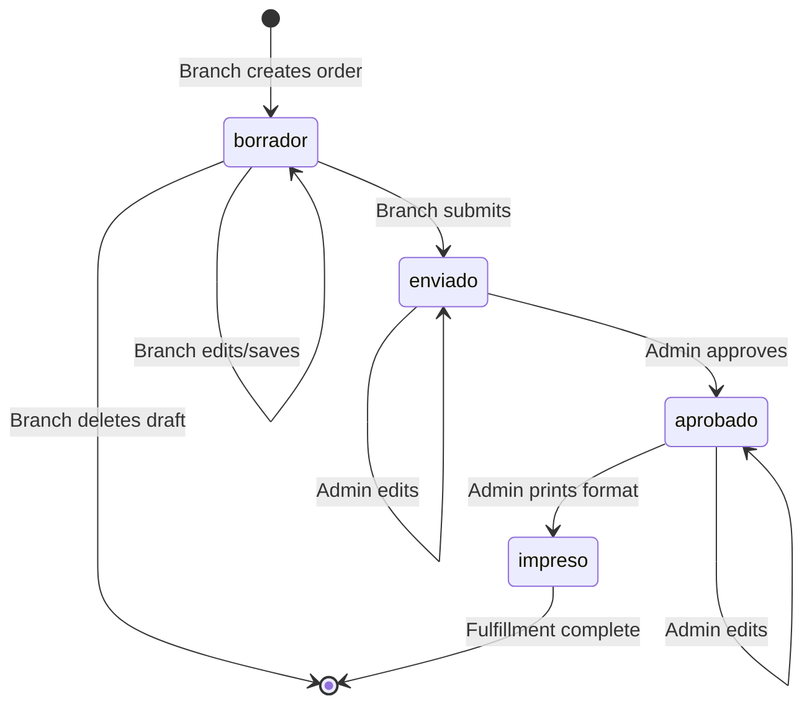

Every order in CEDIS Pedidos moves through a defined lifecycle with four distinct states managed by both branch users and administrators.

## The Four States

Orders progress through these states in sequence:

<Steps>
  <Step title="Borrador" icon="pencil">
    <Info>
      **Draft** - Initial state when branch creates an order
    </Info>
    
    **Visual Indicator:**
    ```
    ● Borrador
    ```
    Badge color: Gray (`bg-gray-100 text-gray-700 border-gray-300`)
    
    **Characteristics:**
    - Editable by branch user
    - Deletable by branch user
    - Not visible in admin approval queue
    - Auto-saved every 30 seconds
    - Not yet submitted for review
    
    **Available Actions:**
    - Edit quantities and materials
    - Change delivery date/type
    - Save changes
    - Delete entirely
    - Submit to move to next state
  </Step>

  <Step title="Enviado" icon="paper-plane">
    <Warning>
      **Submitted** - Order sent for CEDIS review (read-only for branch)
    </Warning>
    
    **Visual Indicator:**
    ```
    ● Enviado
    ```
    Badge color: Amber (`bg-amber-50 text-amber-700 border-amber-300`)
    
    **Characteristics:**
    - Read-only for branch users
    - Visible in admin dashboard
    - Timestamp recorded in `enviado_at`
    - User recorded in `enviado_por`
    - Awaiting admin approval
    
    **Available Actions:**
    - **Branch:** View only, export PDF
    - **Admin:** Edit, approve, or reject
    
    <Note>
      This is the primary review state. Admins validate quantities and delivery feasibility before approval.
    </Note>
  </Step>

  <Step title="Aprobado" icon="check-circle">
    <Info>
      **Approved** - Admin has validated and approved the order
    </Info>
    
    **Visual Indicator:**
    ```
    ● Aprobado
    ```
    Badge color: Emerald (`bg-emerald-50 text-emerald-700 border-emerald-300`)
    
    **Characteristics:**
    - Admin-approved for fulfillment
    - Ready for warehouse picking
    - Fulfillment format available
    - Read-only for branch users
    - Admin can still edit if needed
    
    **Available Actions:**
    - **Branch:** View and export PDF
    - **Admin:** Print format, mark as printed, edit if critical changes needed
  </Step>

  <Step title="Impreso" icon="printer">
    <Info>
      **Printed** - Fulfillment format printed, order in progress
    </Info>
    
    **Visual Indicator:**
    ```
    ● Impreso
    ```
    Badge color: Blue (`bg-blue-50 text-blue-700 border-blue-300`)
    
    **Characteristics:**
    - Warehouse has printed picking list
    - Order fulfillment in progress
    - Final state in the system
    - Historical record complete
    
    **Available Actions:**
    - **Branch:** View final details
    - **Admin:** View, track completion, edit if emergency changes required
  </Step>
</Steps>

## State Transition Diagram



## State Constants

From `src/lib/constants.ts:49-61`:

```typescript
export const ESTADO_LABELS: Record<string, string> = {
    borrador: 'Borrador',
    enviado: 'Enviado',
    aprobado: 'Aprobado',
    impreso: 'Impreso',
}

export const ESTADO_COLORS: Record<string, string> = {
    borrador: 'bg-gray-100 text-gray-700 border-gray-300',
    enviado: 'bg-amber-50 text-amber-700 border-amber-300',
    aprobado: 'bg-emerald-50 text-emerald-700 border-emerald-300',
    impreso: 'bg-blue-50 text-blue-700 border-blue-300',
}
```

## Permission Matrix

Who can do what in each state:

<Tabs>
  <Tab title="Borrador">
    | Action | Branch User | Admin |
    |--------|-------------|-------|
    | View | ✅ Owner only | ✅ All |
    | Edit | ✅ Owner only | ✅ All |
    | Delete | ✅ Owner only | ❌ No |
    | Save | ✅ Owner only | ✅ All |
    | Submit | ✅ Owner only | ❌ No |
    | Approve | ❌ No | ❌ No |
    | Print | ❌ No | ❌ No |
  </Tab>
  
  <Tab title="Enviado">
    | Action | Branch User | Admin |
    |--------|-------------|-------|
    | View | ✅ Owner only | ✅ All |
    | Edit | ❌ No | ✅ All |
    | Delete | ❌ No | ❌ No |
    | Save | ❌ No | ✅ All |
    | Submit | ❌ No | ❌ No |
    | Approve | ❌ No | ✅ All |
    | Print | ❌ No | ❌ No |
    
    <Warning>
      Branch users see: "Este pedido ya fue enviado. No puedes modificarlo."
    </Warning>
  </Tab>
  
  <Tab title="Aprobado">
    | Action | Branch User | Admin |
    |--------|-------------|-------|
    | View | ✅ Owner only | ✅ All |
    | Edit | ❌ No | ✅ All |
    | Delete | ❌ No | ❌ No |
    | Save | ❌ No | ✅ All |
    | Submit | ❌ No | ❌ No |
    | Approve | ❌ No | ❌ No |
    | Print | ❌ No | ✅ All |
    | Export PDF | ✅ Owner only | ✅ All |
  </Tab>
  
  <Tab title="Impreso">
    | Action | Branch User | Admin |
    |--------|-------------|-------|
    | View | ✅ Owner only | ✅ All |
    | Edit | ❌ No | ✅ All |
    | Delete | ❌ No | ❌ No |
    | Save | ❌ No | ✅ All |
    | Submit | ❌ No | ❌ No |
    | Approve | ❌ No | ❌ No |
    | Print | ❌ No | ❌ No |
    | Export PDF | ✅ Owner only | ✅ All |
  </Tab>
</Tabs>

## Database Schema

From `supabase/schema.sql:45-56`, the `estado` field:

```sql
CREATE TYPE estado_pedido AS ENUM (
  'borrador', 'enviado', 'aprobado', 'impreso'
);

CREATE TABLE pedidos (
  ...
  estado         estado_pedido NOT NULL DEFAULT 'borrador',
  enviado_at     timestamptz,
  enviado_por    uuid REFERENCES users(id)
);
```

**Key fields:**
- `estado`: Current state (enum, defaults to 'borrador')
- `enviado_at`: Timestamp when moved to 'enviado'
- `enviado_por`: User ID who submitted the order

## Row Level Security (RLS)

From `supabase/schema.sql:132-137`, update permissions:

### Branch Users
```sql
CREATE POLICY "pedidos_update_sucursal" ON pedidos FOR UPDATE USING (
  estado = 'borrador'
  AND sucursal_id = (SELECT sucursal_id FROM users WHERE id = auth.uid())
) WITH CHECK (
  sucursal_id = (SELECT sucursal_id FROM users WHERE id = auth.uid())
);
```

<Info>
  Branch users can **only update orders in borrador state** from their own branch.
</Info>

### Administrators
```sql
CREATE POLICY "pedidos_update_admin" ON pedidos FOR UPDATE USING (
  EXISTS (SELECT 1 FROM users WHERE id = auth.uid() AND rol = 'admin')
);
```

<Info>
  Admins can update orders **in any state** without restrictions.
</Info>

## Typical Order Lifecycle Timeline

<Steps>
  <Step title="Day 1: Creation">
    **9:00 AM** - Branch user starts new order (borrador)
    
    **9:30 AM** - User adds materials from catalog
    
    **10:15 AM** - User saves draft, continues later
    
    **3:00 PM** - User finalizes quantities and clicks "Enviar pedido"
    
    **Estado:** borrador → enviado
  </Step>

  <Step title="Day 2: Review">
    **8:00 AM** - Admin sees order in dashboard "Total Enviados" count
    
    **8:30 AM** - Admin reviews materials against inventory
    
    **9:00 AM** - Admin clicks "Aprobar" button
    
    **Estado:** enviado → aprobado
  </Step>

  <Step title="Day 3: Fulfillment">
    **7:00 AM** - Admin exports PDF fulfillment format
    
    **7:15 AM** - Admin clicks "Imprimir" to mark as printed
    
    **8:00 AM** - Warehouse begins picking materials
    
    **Estado:** aprobado → impreso
  </Step>

  <Step title="Day 4: Delivery">
    Materials picked, loaded, and delivered to branch
    
    Order remains in "impreso" as historical record
  </Step>
</Steps>

## Special Cases

### Editing After Submission

If an admin needs to modify a submitted order:

<Steps>
  <Step title="Admin opens order">
    Navigate to Dashboard, find order in enviado state
  </Step>
  
  <Step title="Click pencil icon">
    Opens order in edit mode (admins bypass read-only restriction)
  </Step>
  
  <Step title="Make changes">
    Adjust quantities, dates, or materials
  </Step>
  
  <Step title="Save changes">
    Click "Guardar cambios" - order remains in current state
  </Step>
  
  <Step title="Continue workflow">
    Approve when ready - state transitions normally
  </Step>
</Steps>

<Warning>
  Communicate any changes to the branch - they see read-only view and won't know about edits.
</Warning>

### Deleting Orders

From `src/pages/MisPedidos.tsx:34-52`:

```typescript
const handleDelete = async (pedidoId: string) => {
    // Delete detalles first (foreign key)
    await supabase.from('pedido_detalle').delete().eq('pedido_id', pedidoId)
    await supabase.from('pedidos').delete().eq('id', pedidoId)
}
```

<Info>
  Only **borrador** orders show the delete button. Once submitted (enviado), orders cannot be deleted.
</Info>

## Best Practices

<AccordionGroup>
  <Accordion title="For Branch Users">
    - **Save frequently** as borrador while building orders
    - **Review carefully** before submitting - you can't edit after enviado
    - **Check weight limits** before submission
    - **Monitor state changes** in Mis Pedidos to track approval progress
  </Accordion>
  
  <Accordion title="For Administrators">
    - **Review enviado orders daily** - don't let them accumulate
    - **Approve promptly** to give warehouse adequate prep time
    - **Print formats early** for next-day deliveries
    - **Communicate edits** if you modify submitted orders
    - **Use filters** to manage high-volume periods (filter by estado)
  </Accordion>
  
  <Accordion title="For System Integrators">
    - **Respect RLS policies** - don't bypass security
    - **Set enviado_at and enviado_por** when transitioning to enviado
    - **Validate state transitions** - follow the allowed flow
    - **Use estado_pedido enum** - don't use string literals
  </Accordion>
</AccordionGroup>

## Monitoring Order Flow

Admins can track order flow health using dashboard metrics:

<CardGroup cols={2}>
  <Card title="High Enviados Count" icon="triangle-exclamation" color="#DC2626">
    **Problem:** Backlog building up
    
    **Action:** Prioritize reviews, add admin capacity
  </Card>
  <Card title="Low Aprobados Count" icon="circle-check" color="#10B981">
    **Status:** Healthy flow
    
    **Meaning:** Orders moving through system efficiently
  </Card>
  <Card title="Many Printed Today" icon="print" color="#2B5EA7">
    **Status:** Active fulfillment
    
    **Meaning:** Warehouse busy with current orders
  </Card>
  <Card title="High Weekly Tonnage" icon="weight-scale" color="#F59E0B">
    **Alert:** Capacity concern
    
    **Action:** Plan additional truck capacity
  </Card>
</CardGroup>
