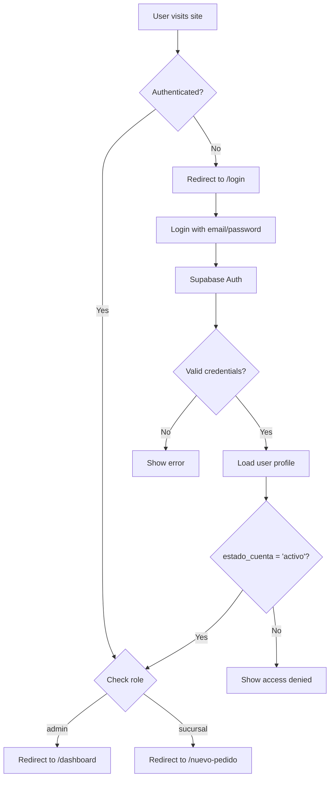
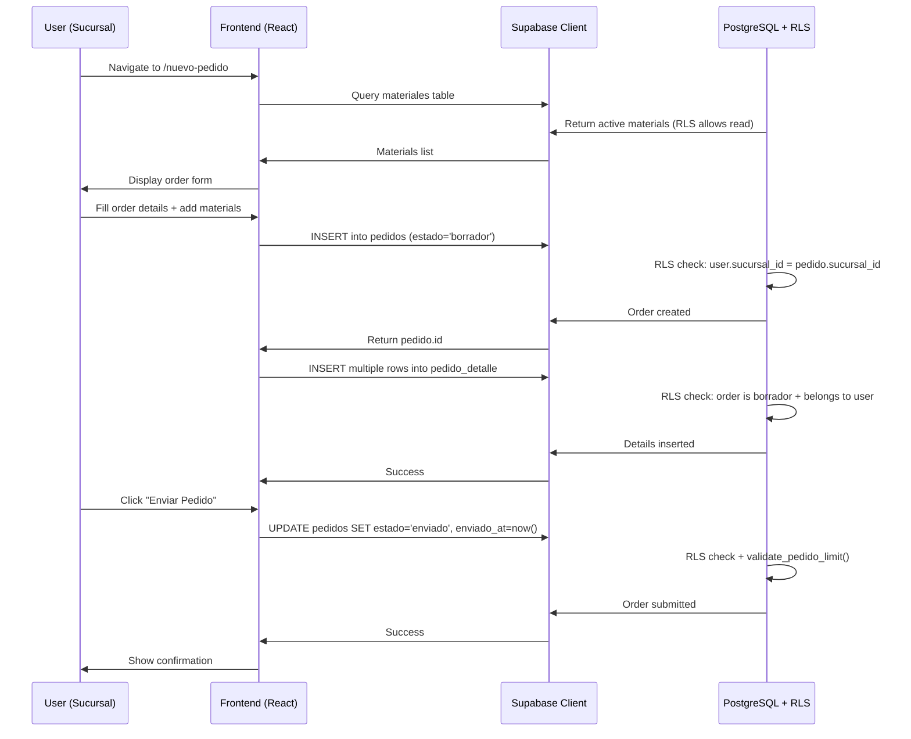

## Overview

CEDIS Pedidos is a modern web application built for managing material orders across multiple branch offices (sucursales). The system uses a three-tier architecture with React frontend, Supabase backend, and PostgreSQL database.

<Note>
  The application enforces role-based access control (RBAC) with two user roles: **admin** (CEDIS administrators) and **sucursal** (branch office users).
</Note>

## Technology Stack

### Frontend Technologies

<Accordion title="React & Build Tools">
  - **React 19.0.0** - UI library with latest concurrent features
  - **React Router DOM 7.2.0** - Client-side routing and navigation
  - **Vite 6.2.0** - Fast build tool and dev server
  - **TypeScript 5.7.2** - Type-safe development
  - **Tailwind CSS 4.0.9** - Utility-first styling framework
</Accordion>

<Accordion title="UI Components & Libraries">
  - **Radix UI** - Accessible headless component primitives:
    - Alert Dialog, Avatar, Dialog, Dropdown Menu
    - Label, Progress, Select, Separator, Slot
    - Toast notifications, Tooltips
  - **Lucide React 0.475.0** - Icon library
  - **class-variance-authority** - Component variant management
  - **clsx & tailwind-merge** - Conditional class composition
</Accordion>

<Accordion title="State Management & Utilities">
  - **Zustand 5.0.3** - Lightweight state management
  - **date-fns 4.1.0** - Date manipulation and formatting
  - **html2pdf.js 0.10.2** - PDF generation for order prints
</Accordion>

### Backend Technologies

<Info>
  CEDIS Pedidos uses **Supabase** as a Backend-as-a-Service (BaaS), providing:
  - PostgreSQL database with Row Level Security (RLS)
  - Authentication and user management
  - Real-time subscriptions
  - RESTful API and PostgREST
</Info>

- **@supabase/supabase-js 2.48.1** - Official Supabase client library
- **PostgreSQL** - Relational database (via Supabase)
- **PostgREST** - Automatic REST API generation

## Application Architecture

### Frontend Structure

The application follows a component-based architecture organized by feature:

```
src/
├── App.tsx              # Main routing and app structure
├── components/          # Reusable UI components
│   ├── layout/          # Layout components (Layout, Navigation)
│   └── ProtectedRoute   # Authentication guards
├── context/             # React context providers
│   ├── AuthContext      # Authentication state management
│   └── ThemeProvider    # Theme/dark mode management
├── pages/               # Route-based page components
│   ├── Login            # Authentication page
│   ├── Dashboard        # Admin dashboard
│   ├── NuevoPedido      # Create/edit orders
│   ├── MisPedidos       # Order history
│   ├── CatalogoMateriales # Material catalog (admin)
│   └── FormatoImprimible  # Printable order format
├── lib/                 # Core utilities
│   ├── supabase.ts      # Supabase client configuration
│   └── types.ts         # TypeScript type definitions
└── hooks/               # Custom React hooks
```

### Routing Architecture

The application uses role-based routing defined in `src/App.tsx:1`:

<Accordion title="Public Routes">
  - `/login` - Authentication page (no auth required)
</Accordion>

<Accordion title="Admin Routes (rol='admin')">
  - `/dashboard` - Order management dashboard
  - `/catalogo` - Material catalog administration
  - `/historial` - Complete order history
</Accordion>

<Accordion title="Sucursal Routes (rol='sucursal')">
  - `/nuevo-pedido` - Create new order
  - `/mis-pedidos` - View branch's orders
  - `/nuevo-pedido/:id` - Edit existing order
</Accordion>

<Accordion title="Shared Routes (authenticated)">
  - `/imprimir/:id` - Printable order format (no sidebar)
  - `/` - Root redirect based on role
</Accordion>

### Authentication Flow



<Note>
  The `ProtectedRoute` component (src/components/ProtectedRoute) enforces authentication and role-based access at the route level.
</Note>

## Database Architecture

### Core Tables

The database consists of 6 main tables:

<Accordion title="sucursales - Branch Offices">
  Stores branch office information:
  - `id` (uuid, PK)
  - `nombre` - Full branch name
  - `abreviacion` - Unique branch code
  - `ciudad` - City location
  - `activa` - Active status flag
</Accordion>

<Accordion title="users - User Profiles">
  Extends Supabase auth.users with application-specific data:
  - `id` (uuid, PK) - References auth.users
  - `nombre`, `email`, `rol` (admin/sucursal)
  - `sucursal_id` - Foreign key to sucursales
  - `estado_cuenta` - Account status (pendiente/activo/inactivo)
  - `es_superadmin` - Superadmin flag
</Accordion>

<Accordion title="materiales - Material Catalog">
  168 materials organized in 5 categories:
  - `id` (uuid, PK)
  - `codigo` - Material code (nullable)
  - `nombre` - Material name
  - `categoria` - Enum: materia_prima, esencia, varios, envase_vacio, color
  - `unidad_base` - Unit of measurement
  - `peso_aproximado` - Approximate weight
  - `envase` - Container type
  - `orden` - Display order
  - `activo` - Active status
</Accordion>

<Accordion title="pedidos - Orders">
  Main order records:
  - `id` (uuid, PK)
  - `codigo_pedido` - Unique order code
  - `sucursal_id` - Foreign key to branch
  - `fecha_entrega` - Delivery date
  - `tipo_entrega` - Delivery type (HINO/Recolección en CEDIS)
  - `total_kilos` - Total weight in kg
  - `estado` - Status: borrador, enviado, aprobado, impreso
  - `created_at`, `updated_at` - Timestamps
  - `enviado_at`, `enviado_por` - Submission tracking
</Accordion>

<Accordion title="pedido_detalle - Order Line Items">
  Individual material quantities per order:
  - `id` (uuid, PK)
  - `pedido_id` - Foreign key to pedidos
  - `material_id` - Foreign key to materiales
  - `cantidad_kilos` - Quantity in kg
  - `cantidad_solicitada` - Requested quantity
  - `peso_total` - Total weight
  - `lote`, `peso` - Batch and weight fields
  - UNIQUE constraint on (pedido_id, material_id)
</Accordion>

<Accordion title="solicitudes_acceso - Access Requests">
  User registration and approval workflow:
  - `id` (uuid, PK)
  - `user_id` - Foreign key to users (nullable)
  - `nombre`, `email`, `sucursal_id`
  - `mensaje` - Request message
  - `estado` - Status: pendiente, aprobado, rechazado
  - `revisado_por`, `revisado_at` - Approval tracking
  - `created_at` - Timestamp
</Accordion>

### Database Functions

The system includes a custom PostgreSQL function:

**`validate_pedido_limit(p_pedido_id uuid)`** - Validates order weight limit
- Returns `boolean`
- Checks if order total_kilos < 13,000 kg (absolute database maximum; frontend enforces 11,500 kg)
- Defined as `SECURITY DEFINER` (runs with elevated privileges)
- Source: `supabase/schema.sql:97`

## Supabase Client Configuration

The Supabase client is initialized in `src/lib/supabase.ts:1`:

```typescript
import { createClient } from '@supabase/supabase-js'

const supabaseUrl = import.meta.env.VITE_SUPABASE_URL
const supabaseAnonKey = import.meta.env.VITE_SUPABASE_ANON_KEY

export const supabase = createClient(supabaseUrl, supabaseAnonKey)
```

<Info>
  Environment variables are loaded from `.env` file:
  - `VITE_SUPABASE_URL` - Supabase project URL
  - `VITE_SUPABASE_ANON_KEY` - Anonymous/public API key
</Info>

The client provides:
- **Authentication**: `supabase.auth` - Sign in, sign out, session management
- **Database**: `supabase.from('table')` - Query builder for CRUD operations
- **Real-time**: `supabase.channel()` - Real-time subscriptions (if needed)

## Build Configuration

Vite configuration from `vite.config.ts:1`:

```typescript
import { defineConfig } from 'vite'
import react from '@vitejs/plugin-react'
import tailwindcss from '@tailwindcss/vite'
import path from 'path'

export default defineConfig({
  plugins: [
    react(),           // React Fast Refresh
    tailwindcss(),     // Tailwind CSS integration
  ],
  resolve: {
    alias: {
      "@": path.resolve(__dirname, "./src"),  // @ alias for imports
    },
  },
  server: {
    host: true,        // Allow network connections
  },
})
```

### Build Scripts

From `package.json:6`:

- **`npm run dev`** - Start Vite dev server
- **`npm run build`** - TypeScript check + production build
- **`npm run preview`** - Preview production build
- **`npm run lint`** - Run ESLint

## Security Features

<Accordion title="Row Level Security (RLS)">
  All tables use PostgreSQL RLS policies to enforce access control at the database level. See [Security](/technical/security) for complete policy documentation.
</Accordion>

<Accordion title="Authentication">
  - Supabase Auth handles user authentication
  - JWT tokens stored in localStorage
  - Session persistence and refresh
  - Account status validation (`estado_cuenta = 'activo'`)
</Accordion>

<Accordion title="Frontend Guards">
  - `ProtectedRoute` component wraps authenticated routes
  - `allowedRoles` prop enforces role-based access
  - Automatic redirect to login for unauthenticated users
</Accordion>

## Data Flow Example: Creating an Order



<Note>
  Every database operation is validated by RLS policies before execution, ensuring users can only access their own branch's data (or all data for admins).
</Note>

## Performance Considerations

### Database Indexes

Optimized queries with indexes on frequently accessed columns:

- `idx_pedidos_sucursal` - Fast branch filtering
- `idx_pedidos_estado` - Fast status filtering
- `idx_pedidos_fecha` - Date range queries
- `idx_detalle_pedido` - Order line item lookups
- `idx_detalle_material` - Material usage queries

Source: `supabase/schema.sql:73`

### Frontend Optimizations

- **Code splitting** - React Router lazy loading (can be implemented)
- **Zustand state** - Minimal re-renders
- **Vite dev server** - Hot Module Replacement (HMR)
- **Production build** - Tree shaking, minification

## Deployment Architecture

<Info>
  **Frontend**: Deployed as static site (Vite build output)
  
  **Backend**: Supabase cloud hosting
  
  **Database**: Managed PostgreSQL on Supabase infrastructure
</Info>

The application can be deployed to:
- Vercel, Netlify, or any static hosting
- Docker container (with nginx)
- Traditional web server (Apache, Nginx)

Environment variables must be configured in the deployment environment.
