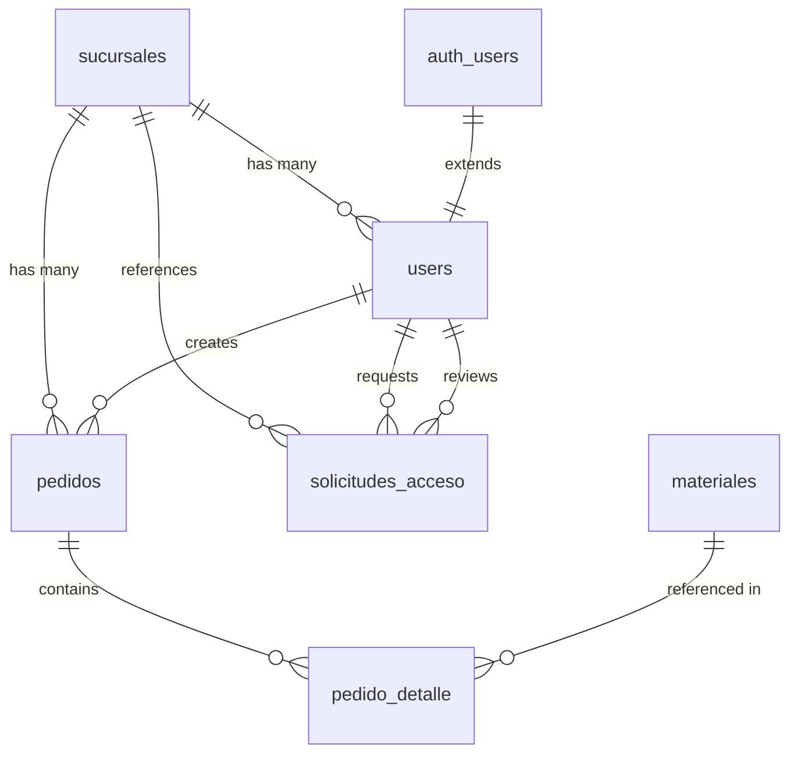

## Schema Overview

The CEDIS Pedidos database uses PostgreSQL with 6 main tables, 5 enum types, and Row Level Security policies. The schema is defined in `supabase/schema.sql`.

<Info>
  The database contains **168 pre-seeded materials** across 5 categories:
  - 40 Materias Primas (Raw Materials)
  - 82 Esencias (Fragrances)
  - 21 Varios (Miscellaneous)
  - 14 Envases Vacíos (Empty Containers)
  - 11 Colores (Colors)
</Info>

## Entity Relationship Diagram



## Enum Types

### categoria_enum

Material categories for organizing the catalog:

```sql
CREATE TYPE categoria_enum AS ENUM (
  'materia_prima',  -- Raw materials (chemicals, compounds)
  'esencia',        -- Fragrances and scents
  'varios',         -- Miscellaneous items
  'envase_vacio',   -- Empty containers and packaging
  'color'           -- Colorants and dyes
);
```

### rol_enum

User roles in the system:

```sql
CREATE TYPE rol_enum AS ENUM (
  'admin',     -- CEDIS administrators
  'sucursal'   -- Branch office users
);
```

### estado_pedido

Order workflow states:

```sql
CREATE TYPE estado_pedido AS ENUM (
  'borrador',  -- Draft (editable by sucursal)
  'enviado',   -- Submitted (awaiting admin approval)
  'aprobado',  -- Approved by admin
  'impreso'    -- Printed (final state)
);
```

### Additional Enums (in TypeScript)

These are enforced in the application layer and database constraints:

- **EstadoCuenta**: `'pendiente' | 'activo' | 'inactivo'`
- **TipoEntrega**: `'HINO' | 'Recolección en CEDIS'`
- **EstadoSolicitud**: `'pendiente' | 'aprobado' | 'rechazado'`

## Tables

### sucursales

Branch office locations.

```sql
CREATE TABLE sucursales (
  id          uuid PRIMARY KEY DEFAULT gen_random_uuid(),
  nombre      text NOT NULL,
  abreviacion text UNIQUE NOT NULL,
  ciudad      text NOT NULL,
  activa      boolean NOT NULL DEFAULT true
);
```

**Columns:**

| Column | Type | Constraints | Description |
|--------|------|-------------|-------------|
| `id` | uuid | PK | Unique identifier |
| `nombre` | text | NOT NULL | Full branch name |
| `abreviacion` | text | UNIQUE, NOT NULL | Short code (e.g., "PAC1", "GDL") |
| `ciudad` | text | NOT NULL | City location |
| `activa` | boolean | NOT NULL, DEFAULT true | Active status flag |

**Seeded Data:**

<Accordion title="View Pre-loaded Branch Offices">
  | Nombre | Abreviación | Ciudad |
  |--------|-------------|--------|
  | Pachuca I | PAC1 | Pachuca |
  | Guadalajara | GDL | Guadalajara |
  | CDMX Norte | CDMX | Ciudad de México |

  Source: `supabase/schema.sql:193`
</Accordion>

**TypeScript Type:**

```typescript
interface Sucursal {
  id: string
  nombre: string
  abreviacion: string
  ciudad: string
  activa: boolean
}
```

Defined in `src/lib/types.ts:22`

---

### users

User profiles extending Supabase auth.users.

```sql
CREATE TABLE users (
  id              uuid PRIMARY KEY REFERENCES auth.users ON DELETE CASCADE,
  nombre          text NOT NULL,
  email           text UNIQUE NOT NULL,
  rol             rol_enum NOT NULL,
  sucursal_id     uuid REFERENCES sucursales(id) ON DELETE SET NULL,
  estado_cuenta   text NOT NULL DEFAULT 'activo'
                    CHECK (estado_cuenta IN ('pendiente','activo','inactivo')),
  es_superadmin   boolean NOT NULL DEFAULT false
);
```

**Columns:**

| Column | Type | Constraints | Description |
|--------|------|-------------|-------------|
| `id` | uuid | PK, FK → auth.users | User ID from Supabase Auth |
| `nombre` | text | NOT NULL | Full name |
| `email` | text | UNIQUE, NOT NULL | Email address |
| `rol` | rol_enum | NOT NULL | User role (admin/sucursal) |
| `sucursal_id` | uuid | FK → sucursales, NULL for admins | Assigned branch |
| `estado_cuenta` | text | CHECK constraint | Account status |
| `es_superadmin` | boolean | DEFAULT false | Superadmin flag (bypass some restrictions) |

**TypeScript Type:**

```typescript
interface UserProfile {
  id: string
  nombre: string
  email: string
  rol: 'admin' | 'sucursal'
  sucursal_id: string | null
  sucursal?: Sucursal
  estado_cuenta: 'pendiente' | 'activo' | 'inactivo'
  es_superadmin: boolean
}
```

Defined in `src/lib/types.ts:30`

<Note>
  The `users` table extends Supabase's `auth.users` table. When an auth user is deleted, the profile is automatically removed (CASCADE).
</Note>

---

### materiales

Material catalog with 168 pre-seeded items.

```sql
CREATE TABLE materiales (
  id               uuid PRIMARY KEY DEFAULT gen_random_uuid(),
  codigo           text UNIQUE,
  nombre           text NOT NULL,
  categoria        categoria_enum NOT NULL,
  unidad_base      text NOT NULL DEFAULT 'kgs',
  peso_aproximado  numeric,
  envase           text,
  orden            integer NOT NULL,
  activo           boolean NOT NULL DEFAULT true
);
```

**Columns:**

| Column | Type | Constraints | Description |
|--------|------|-------------|-------------|
| `id` | uuid | PK | Unique identifier |
| `codigo` | text | UNIQUE, nullable | Material code (not all materials have codes) |
| `nombre` | text | NOT NULL | Material name |
| `categoria` | categoria_enum | NOT NULL | Category (see enum types) |
| `unidad_base` | text | NOT NULL, DEFAULT 'kgs' | Unit of measurement |
| `peso_aproximado` | numeric | nullable | Approximate weight per container |
| `envase` | text | nullable | Container type/size |
| `orden` | integer | NOT NULL | Display order within category |
| `activo` | boolean | NOT NULL, DEFAULT true | Active status (added in migration) |

**TypeScript Type:**

```typescript
interface Material {
  id: string
  codigo: string | null
  nombre: string
  categoria: 'materia_prima' | 'esencia' | 'varios' | 'envase_vacio' | 'color'
  unidad_base: string
  peso_aproximado: number | null
  envase: string | null
  orden: number
  activo: boolean
}
```

Defined in `src/lib/types.ts:55`

**Material Categories Distribution:**

<Accordion title="Materias Primas (40 items)">
  Raw materials for chemical production:
  - Aceite De Pino, Aceite De Silicon, Aceite Mineral
  - Alcohol Etilico, Alcohol Laurico, Alfagin, Amgin
  - Amida De Coco, Antiespumante, Blend CHJO-22
  - Butil Cellosolve, Conservadores, Creolina
  - Edgin, Emulsificante, Formol, Gas Nafta
  - Glicerina, Hexano, Lasgin, Less, Nacarante
  - Nonil, Oxagin, Pasta Suavizante, Peroxido
  - Q60, Silicon, Sosa Liquida, Syngin, T-20
  - Trieta, Vaselina Solida
  
  Source: `supabase/schema.sql:203`
</Accordion>

<Accordion title="Esencias (82 items)">
  Fragrances for cleaning products:
  - Alaska, Almendra, Aloe Vera, Amaderado, Amor
  - Aqua Fresh, Azahar, Baby, Bebe Fresh, Blue Softener
  - Brisas, Brisa Tropical, Canela, Cedar Wood, Cereza
  - Citronela, Citrus, Clavel, Coco, Cocktail, Cuero
  - Durazno, Eucalipto, Floral, Flores Blancas, Fresa
  - Gardenia, Herbal, Jazmin, Lavanda (Francesa/Inglesa)
  - Lemon Fresh, Limon, Lila, Lluvia, Magnolia
  - Mango, Manzana, Marine, Melon, Menta, Miel
  - Naranja, Nardo, Neroli, Ocean, Orquidea
  - Pina, Pino, Primavera, Rosas, Sandalo, Talco
  - Uva, Vainilla, Verde, Violeta, White Musk, Yuzu
  - And many more...
  
  Source: `supabase/schema.sql:246`
</Accordion>

<Accordion title="Varios (21 items)">
  Miscellaneous supplies:
  - Amonaco, Antiginscal, Alcohol Cetilico
  - Base Insecticida, Citrico, Gyrgen
  - Jarras, Optgin, Past. Tikilín 1"
  - Pesalejías, Probetas, Rollos de Ticket
  - Sal Industrial, Sebo Destilado, Silica Gel
  - Tiras pH, Tinopal CBS-X, Tripolifosfato
  - Urea, Zeolita, Zeolita Cargada
  
  Source: `supabase/schema.sql:331`
</Accordion>

<Accordion title="Envases Vacíos (14 items)">
  Empty containers and packaging:
  - Botella nueva de 1 Lt (150 pcs packages)
  - Contenedor de 1,000 Lts
  - Tambo De Plastico 200 Lts (Abierto/Cerrado)
  - Tambo De Metal 200 Lts
  - Garrafon 10 Lts c/Tapa (24 pcs packages)
  - Garrafon 20 Lts c/Tapa (12 pcs packages)
  - Cubeta Blanca 19 Lts (con/sin tapa)
  - Cubeta Amarilla 19 Lts
  - Bolsa Polietileno 10kg
  - Cajas de Carton
  - Tapa Garrafon 20 Lts
  
  Source: `supabase/schema.sql:355`
</Accordion>

<Accordion title="Colores (11 items)">
  Colorants and dyes:
  - Amarillo Fluorescente, Amarillo Huevo
  - Azul, Azul Brillante, Azul Marino
  - Color Morado, Naranja, Pigmento Rojo
  - Rosa, Rojo, Verde
  
  Source: `supabase/schema.sql:372`
</Accordion>

---

### pedidos

Main order/requisition records.

```sql
CREATE TABLE pedidos (
  id             uuid PRIMARY KEY DEFAULT gen_random_uuid(),
  codigo_pedido  text UNIQUE NOT NULL,
  sucursal_id    uuid NOT NULL REFERENCES sucursales(id),
  fecha_entrega  date NOT NULL,
  tipo_entrega   text,
  total_kilos    numeric NOT NULL DEFAULT 0,
  estado         estado_pedido NOT NULL DEFAULT 'borrador',
  created_at     timestamptz NOT NULL DEFAULT now(),
  updated_at     timestamptz NOT NULL DEFAULT now(),
  enviado_at     timestamptz,
  enviado_por    uuid REFERENCES users(id)
);
```

**Columns:**

| Column | Type | Constraints | Description |
|--------|------|-------------|-------------|
| `id` | uuid | PK | Unique identifier |
| `codigo_pedido` | text | UNIQUE, NOT NULL | Order code (e.g., "PAC1-2024-001") |
| `sucursal_id` | uuid | FK → sucursales | Branch that created the order |
| `fecha_entrega` | date | NOT NULL | Requested delivery date |
| `tipo_entrega` | text | nullable | Delivery type (HINO/Recolección) |
| `total_kilos` | numeric | NOT NULL, DEFAULT 0 | Total weight in kilograms |
| `estado` | estado_pedido | NOT NULL, DEFAULT 'borrador' | Current order status |
| `created_at` | timestamptz | NOT NULL, DEFAULT now() | Creation timestamp |
| `updated_at` | timestamptz | NOT NULL, DEFAULT now() | Last update timestamp |
| `enviado_at` | timestamptz | nullable | Submission timestamp |
| `enviado_por` | uuid | FK → users | User who submitted the order |

**Indexes:**

```sql
CREATE INDEX idx_pedidos_sucursal  ON pedidos(sucursal_id);
CREATE INDEX idx_pedidos_estado    ON pedidos(estado);
CREATE INDEX idx_pedidos_fecha     ON pedidos(fecha_entrega);
```

**Triggers:**

```sql
CREATE TRIGGER trg_pedidos_updated_at
  BEFORE UPDATE ON pedidos
  FOR EACH ROW EXECUTE FUNCTION update_updated_at();
```

Automatically updates `updated_at` timestamp on every UPDATE.

**TypeScript Type:**

```typescript
interface Pedido {
  id: string
  codigo_pedido: string
  sucursal_id: string
  fecha_entrega: string
  tipo_entrega: 'HINO' | 'Recolección en CEDIS' | null
  total_kilos: number
  estado: 'borrador' | 'enviado' | 'aprobado' | 'impreso'
  created_at: string
  updated_at: string
  enviado_at: string | null
  enviado_por: string | null
  sucursal?: Sucursal
}
```

Defined in `src/lib/types.ts:67`

<Note>
  Orders have a **13,000 kg limit** enforced by the `validate_pedido_limit()` function.
</Note>

---

### pedido_detalle

Order line items (many-to-many between orders and materials).

```sql
CREATE TABLE pedido_detalle (
  id                  uuid PRIMARY KEY DEFAULT gen_random_uuid(),
  pedido_id           uuid NOT NULL REFERENCES pedidos(id) ON DELETE CASCADE,
  material_id         uuid NOT NULL REFERENCES materiales(id),
  cantidad_kilos      numeric,
  cantidad_solicitada numeric,
  peso_total          numeric,
  lote                text,
  peso                numeric,
  UNIQUE (pedido_id, material_id)
);
```

**Columns:**

| Column | Type | Constraints | Description |
|--------|------|-------------|-------------|
| `id` | uuid | PK | Unique identifier |
| `pedido_id` | uuid | FK → pedidos, CASCADE delete | Parent order |
| `material_id` | uuid | FK → materiales | Material being requested |
| `cantidad_kilos` | numeric | nullable | Quantity in kilograms |
| `cantidad_solicitada` | numeric | nullable | Requested quantity (units) |
| `peso_total` | numeric | nullable | Total weight for this line |
| `lote` | text | nullable | Batch/lot number |
| `peso` | numeric | nullable | Individual weight |

**Unique Constraint:**

```sql
UNIQUE (pedido_id, material_id)
```

Each material can only appear once per order.

**Indexes:**

```sql
CREATE INDEX idx_detalle_pedido    ON pedido_detalle(pedido_id);
CREATE INDEX idx_detalle_material  ON pedido_detalle(material_id);
```

**TypeScript Type:**

```typescript
interface PedidoDetalle {
  id: string
  pedido_id: string
  material_id: string
  cantidad_kilos: number | null
  cantidad_solicitada: number | null
  peso_total: number | null
  lote: string | null
  peso: number | null
  material?: Material
}
```

Defined in `src/lib/types.ts:82`

<Info>
  When an order is deleted, all associated detail records are automatically removed due to `ON DELETE CASCADE`.
</Info>

---

### solicitudes_acceso

User registration and access approval workflow.

```sql
CREATE TABLE solicitudes_acceso (
  id            uuid PRIMARY KEY DEFAULT gen_random_uuid(),
  user_id       uuid REFERENCES users(id) ON DELETE CASCADE,
  nombre        text NOT NULL,
  email         text NOT NULL,
  sucursal_id   uuid REFERENCES sucursales(id),
  mensaje       text,
  estado        text NOT NULL DEFAULT 'pendiente'
                  CHECK (estado IN ('pendiente','aprobado','rechazado')),
  revisado_por  uuid REFERENCES users(id),
  revisado_at   timestamptz,
  created_at    timestamptz NOT NULL DEFAULT now()
);
```

**Columns:**

| Column | Type | Constraints | Description |
|--------|------|-------------|-------------|
| `id` | uuid | PK | Unique identifier |
| `user_id` | uuid | FK → users, nullable | Linked user after approval |
| `nombre` | text | NOT NULL | Requester's full name |
| `email` | text | NOT NULL | Requester's email |
| `sucursal_id` | uuid | FK → sucursales, nullable | Requested branch assignment |
| `mensaje` | text | nullable | Request message/reason |
| `estado` | text | CHECK constraint | Request status |
| `revisado_por` | uuid | FK → users, nullable | Admin who reviewed |
| `revisado_at` | timestamptz | nullable | Review timestamp |
| `created_at` | timestamptz | NOT NULL, DEFAULT now() | Request creation time |

**TypeScript Type:**

```typescript
interface SolicitudAcceso {
  id: string
  user_id: string | null
  nombre: string
  email: string
  sucursal_id: string | null
  sucursal?: Sucursal
  mensaje: string | null
  estado: 'pendiente' | 'aprobado' | 'rechazado'
  revisado_por: string | null
  revisado_at: string | null
  created_at: string
}
```

Defined in `src/lib/types.ts:41`

---

## Database Functions

### validate_pedido_limit

Validates that an order doesn't exceed the 13,000 kg limit.

```sql
CREATE OR REPLACE FUNCTION validate_pedido_limit(p_pedido_id uuid)
RETURNS boolean LANGUAGE sql SECURITY DEFINER AS $$
  SELECT COALESCE(total_kilos, 0) < 13000
  FROM pedidos WHERE id = p_pedido_id;
$$;
```

**Usage:**

```typescript
const { data: isValid } = await supabase
  .rpc('validate_pedido_limit', { p_pedido_id: orderId })

if (!isValid) {
  throw new Error('Order exceeds 13,000 kg limit')
}
```

**Security:**
- Defined as `SECURITY DEFINER` - runs with function owner's privileges
- Allows RLS-restricted users to check limits on their own orders

Source: `supabase/schema.sql:97`

---

## TypeScript Type Definitions

Complete database type definitions are available in `src/lib/types.ts:114`:

```typescript
export interface Database {
  public: {
    Tables: {
      sucursales: {
        Row: Sucursal
        Insert: Omit<Sucursal, 'id'>
        Update: Partial<Omit<Sucursal, 'id'>>
      }
      users: {
        Row: UserProfile
        Insert: Omit<UserProfile, 'sucursal'>
        Update: Partial<Omit<UserProfile, 'id' | 'sucursal'>>
      }
      materiales: {
        Row: Material
        Insert: Omit<Material, 'id'>
        Update: Partial<Omit<Material, 'id'>>
      }
      pedidos: {
        Row: Pedido
        Insert: Omit<Pedido, 'id' | 'created_at' | 'updated_at' | 'sucursal'>
        Update: Partial<Omit<Pedido, 'id' | 'sucursal'>>
      }
      pedido_detalle: {
        Row: PedidoDetalle
        Insert: Omit<PedidoDetalle, 'id' | 'material'>
        Update: Partial<Omit<PedidoDetalle, 'id' | 'material'>>
      }
      solicitudes_acceso: {
        Row: SolicitudAcceso
        Insert: Omit<SolicitudAcceso, 'id' | 'created_at'>
        Update: Partial<SolicitudAcceso>
      }
    }
    Functions: {
      validate_pedido_limit: {
        Args: { p_pedido_id: string }
        Returns: boolean
      }
    }
  }
}
```

<Note>
  These types provide full IDE autocomplete and type safety when working with Supabase queries.
</Note>

## Schema Migration History

### Initial Schema

Source: `supabase/schema.sql`

- Core tables and relationships
- Enums and constraints
- RLS policies
- 168 seeded materials
- 3 seeded branch offices

### Access Control Migration

Source: `supabase/add_auth_access_control.sql`

- Added `estado_cuenta` column to users
- Added `es_superadmin` column to users
- Created `solicitudes_acceso` table
- Added RLS policies for access requests
- Set superadmin flags for initial administrators

## Query Examples

### Get All Active Materials by Category

```typescript
const { data: materials } = await supabase
  .from('materiales')
  .select('*')
  .eq('categoria', 'esencia')
  .eq('activo', true)
  .order('orden')
```

### Create Order with Details

```typescript
// 1. Insert order
const { data: pedido } = await supabase
  .from('pedidos')
  .insert({
    codigo_pedido: 'PAC1-2024-001',
    sucursal_id: branchId,
    fecha_entrega: '2024-03-15',
    estado: 'borrador'
  })
  .select()
  .single()

// 2. Insert details
const { data: detalles } = await supabase
  .from('pedido_detalle')
  .insert([
    { pedido_id: pedido.id, material_id: mat1Id, cantidad_kilos: 50 },
    { pedido_id: pedido.id, material_id: mat2Id, cantidad_kilos: 100 }
  ])
```

### Get Orders with Relations

```typescript
const { data: orders } = await supabase
  .from('pedidos')
  .select(`
    *,
    sucursal:sucursales(*),
    pedido_detalle(
      *,
      material:materiales(*)
    )
  `)
  .eq('estado', 'enviado')
  .order('created_at', { ascending: false })
```

<Info>
  All queries are automatically filtered by Row Level Security policies based on the authenticated user's role and branch assignment.
</Info>
