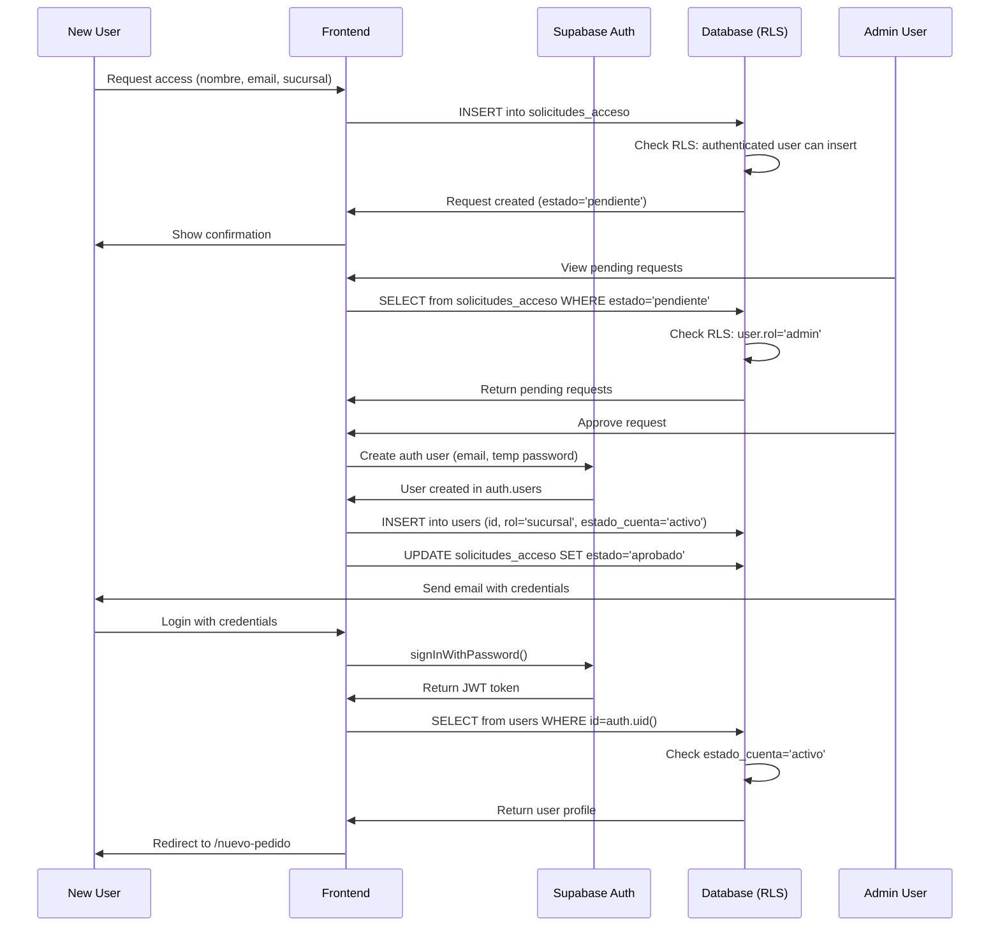

## Security Overview

CEDIS Pedidos implements a multi-layered security approach:

1. **Supabase Authentication** - JWT-based user authentication
2. **Row Level Security (RLS)** - PostgreSQL database-level access control
3. **Frontend Route Guards** - React component-based authorization
4. **Account Status Validation** - Active account requirement
5. **Role-Based Access Control (RBAC)** - Two-tier permission system

<Info>
  **Security Principle**: Access control is enforced at the database level first (RLS policies), with frontend guards providing UX optimization. Users cannot bypass restrictions even with API access.
</Info>

## Authentication Flow

### User Registration Process



### Login Flow

```typescript
// src/context/AuthContext (simplified)

const signIn = async (email: string, password: string) => {
  // 1. Authenticate with Supabase
  const { data: authData, error: authError } = await supabase.auth.signInWithPassword({
    email,
    password
  })
  
  if (authError) throw authError
  
  // 2. Load user profile (includes RLS check)
  const { data: profile, error: profileError } = await supabase
    .from('users')
    .select('*, sucursal:sucursales(*)')
    .eq('id', authData.user.id)
    .single()
  
  if (profileError) throw profileError
  
  // 3. Validate account status
  if (profile.estado_cuenta !== 'activo') {
    throw new Error('Account is not active')
  }
  
  // 4. Set auth state
  setUser(profile)
}
```

**JWT Token Storage:**
- Tokens stored in `localStorage` by Supabase client
- Automatic refresh before expiration
- Invalidated on logout

---

## Row Level Security (RLS) Policies

All tables have RLS enabled to enforce access control at the database level.

### Enabling RLS

```sql
ALTER TABLE sucursales ENABLE ROW LEVEL SECURITY;
ALTER TABLE users ENABLE ROW LEVEL SECURITY;
ALTER TABLE materiales ENABLE ROW LEVEL SECURITY;
ALTER TABLE pedidos ENABLE ROW LEVEL SECURITY;
ALTER TABLE pedido_detalle ENABLE ROW LEVEL SECURITY;
ALTER TABLE solicitudes_acceso ENABLE ROW LEVEL SECURITY;
```

Source: `supabase/schema.sql:106`

---

### sucursales Policies

<Accordion title="sucursales_select - Read Access">
  ```sql
  CREATE POLICY "sucursales_select" ON sucursales FOR SELECT
    USING (auth.role() = 'authenticated');
  ```
  
  **Logic:**
  - Any authenticated user can read all branch offices
  - Required for dropdowns and branch selection
  
  **Source:** `supabase/schema.sql:113`
</Accordion>

**Summary:**
- ✅ All authenticated users: SELECT
- ❌ INSERT/UPDATE/DELETE: No policies (database managed)

---

### users Policies

<Accordion title="users_select - Read Own or Admin Reads All">
  ```sql
  CREATE POLICY "users_select" ON users FOR SELECT
    USING (
      id = auth.uid() 
      OR EXISTS (SELECT 1 FROM users WHERE id = auth.uid() AND rol = 'admin')
    );
  ```
  
  **Logic:**
  - Users can read their own profile
  - Admins can read all user profiles
  
  **Use Cases:**
  - User profile display
  - Admin user management dashboard
  
  **Source:** `supabase/schema.sql:116`
</Accordion>

<Accordion title="users_insert - Self Registration Only">
  ```sql
  CREATE POLICY "users_insert" ON users FOR INSERT
    WITH CHECK (id = auth.uid());
  ```
  
  **Logic:**
  - Users can only insert their own profile (id must match authenticated user ID)
  - Prevents privilege escalation
  
  **Source:** `supabase/schema.sql:118`
</Accordion>

<Accordion title="users_update - Self Update Only">
  ```sql
  CREATE POLICY "users_update" ON users FOR UPDATE
    USING (id = auth.uid());
  ```
  
  **Logic:**
  - Users can only update their own profile
  - Admin updates handled via service role or functions
  
  **Source:** `supabase/schema.sql:119`
</Accordion>

**Summary:**
- ✅ Own profile: SELECT, UPDATE
- ✅ Admins: SELECT all
- ✅ Self registration: INSERT (id=auth.uid())
- ❌ Cross-user modifications: Blocked

---

### materiales Policies

<Accordion title="materiales_select - Read Only for Authenticated">
  ```sql
  CREATE POLICY "materiales_select" ON materiales FOR SELECT
    USING (auth.role() = 'authenticated');
  ```
  
  **Logic:**
  - All authenticated users can read the material catalog
  - Required for order creation and material selection
  
  **Source:** `supabase/schema.sql:122`
</Accordion>

**Summary:**
- ✅ All authenticated users: SELECT
- ❌ INSERT/UPDATE/DELETE: No policies (admin via service role)

---

### pedidos Policies

Orders have the most complex policies with role-based and state-based restrictions.

<Accordion title="pedidos_select - Branch Users See Own, Admins See All">
  ```sql
  CREATE POLICY "pedidos_select" ON pedidos FOR SELECT
    USING (
      EXISTS (SELECT 1 FROM users WHERE id = auth.uid() AND rol = 'admin')
      OR sucursal_id = (SELECT sucursal_id FROM users WHERE id = auth.uid())
    );
  ```
  
  **Logic:**
  - Admins can see all orders
  - Branch users can only see orders from their assigned branch
  
  **Example:**
  - User from "Pachuca I" (sucursal_id=123) only sees pedidos WHERE sucursal_id=123
  - Admin sees all pedidos
  
  **Source:** `supabase/schema.sql:125`
</Accordion>

<Accordion title="pedidos_insert - Branch Users Create for Own Branch">
  ```sql
  CREATE POLICY "pedidos_insert" ON pedidos FOR INSERT
    WITH CHECK (
      sucursal_id = (SELECT sucursal_id FROM users WHERE id = auth.uid())
    );
  ```
  
  **Logic:**
  - Users can only create orders for their assigned branch
  - Prevents creating orders on behalf of other branches
  
  **Validation:**
  - pedido.sucursal_id must equal user.sucursal_id
  
  **Source:** `supabase/schema.sql:129`
</Accordion>

<Accordion title="pedidos_update_sucursal - Draft Orders Only">
  ```sql
  CREATE POLICY "pedidos_update_sucursal" ON pedidos FOR UPDATE
    USING (
      estado = 'borrador'
      AND sucursal_id = (SELECT sucursal_id FROM users WHERE id = auth.uid())
    )
    WITH CHECK (
      sucursal_id = (SELECT sucursal_id FROM users WHERE id = auth.uid())
    );
  ```
  
  **Logic:**
  - Branch users can only update their own branch's orders
  - **AND** only when estado='borrador' (draft state)
  - Once submitted (estado='enviado'), users cannot edit
  
  **Workflow Impact:**
  - Drafts are editable by branch users
  - Submitted orders are locked for branch users
  
  **Source:** `supabase/schema.sql:132`
</Accordion>

<Accordion title="pedidos_update_admin - Admins Update Any Order">
  ```sql
  CREATE POLICY "pedidos_update_admin" ON pedidos FOR UPDATE
    USING (
      EXISTS (SELECT 1 FROM users WHERE id = auth.uid() AND rol = 'admin')
    );
  ```
  
  **Logic:**
  - Admins can update any order regardless of state or branch
  - Used for approving orders (estado='borrador' → 'aprobado')
  - Used for marking as printed (estado='aprobado' → 'impreso')
  
  **Source:** `supabase/schema.sql:138`
</Accordion>

<Accordion title="pedidos_delete_sucursal - Delete Draft Orders Only">
  ```sql
  CREATE POLICY "pedidos_delete_sucursal" ON pedidos FOR DELETE
    USING (
      estado = 'borrador'
      AND sucursal_id = (SELECT sucursal_id FROM users WHERE id = auth.uid())
    );
  ```
  
  **Logic:**
  - Branch users can delete their own draft orders
  - Cannot delete submitted/approved/printed orders
  - Must be from user's branch
  
  **Source:** `supabase/schema.sql:141`
</Accordion>

**Summary:**
- ✅ Branch users: SELECT own, INSERT own, UPDATE drafts only, DELETE drafts only
- ✅ Admins: SELECT all, UPDATE all, DELETE not implemented
- ❌ Cross-branch access: Blocked
- ❌ Edit submitted orders (non-admin): Blocked

---

### pedido_detalle Policies

Order line items inherit access rules from parent orders.

<Accordion title="detalle_select - Follows Parent Order Access">
  ```sql
  CREATE POLICY "detalle_select" ON pedido_detalle FOR SELECT
    USING (
      EXISTS (
        SELECT 1 FROM pedidos p
        WHERE p.id = pedido_id AND (
          EXISTS (SELECT 1 FROM users WHERE id = auth.uid() AND rol = 'admin')
          OR p.sucursal_id = (SELECT sucursal_id FROM users WHERE id = auth.uid())
        )
      )
    );
  ```
  
  **Logic:**
  - If user can access the parent order, they can access the details
  - Reuses pedidos_select logic
  
  **Source:** `supabase/schema.sql:147`
</Accordion>

<Accordion title="detalle_insert - Draft Orders, Own Branch">
  ```sql
  CREATE POLICY "detalle_insert" ON pedido_detalle FOR INSERT
    WITH CHECK (
      EXISTS (
        SELECT 1 FROM pedidos p
        WHERE p.id = pedido_id
          AND p.estado = 'borrador'
          AND p.sucursal_id = (SELECT sucursal_id FROM users WHERE id = auth.uid())
      )
    );
  ```
  
  **Logic:**
  - Can only add line items to draft orders
  - Order must belong to user's branch
  - Cannot add items to submitted orders
  
  **Source:** `supabase/schema.sql:156`
</Accordion>

<Accordion title="detalle_update - Draft Orders, Own Branch">
  ```sql
  CREATE POLICY "detalle_update" ON pedido_detalle FOR UPDATE
    USING (
      EXISTS (
        SELECT 1 FROM pedidos p
        WHERE p.id = pedido_id
          AND p.estado = 'borrador'
          AND p.sucursal_id = (SELECT sucursal_id FROM users WHERE id = auth.uid())
      )
    );
  ```
  
  **Logic:**
  - Can only update line items in draft orders
  - Order must belong to user's branch
  
  **Source:** `supabase/schema.sql:164`
</Accordion>

<Accordion title="detalle_delete - Draft Orders, Own Branch">
  ```sql
  CREATE POLICY "detalle_delete" ON pedido_detalle FOR DELETE
    USING (
      EXISTS (
        SELECT 1 FROM pedidos p
        WHERE p.id = pedido_id
          AND p.estado = 'borrador'
          AND p.sucursal_id = (SELECT sucursal_id FROM users WHERE id = auth.uid())
      )
    );
  ```
  
  **Logic:**
  - Can only delete line items from draft orders
  - Order must belong to user's branch
  
  **Source:** `supabase/schema.sql:172`
</Accordion>

<Accordion title="Admin Override Policies">
  ```sql
  CREATE POLICY "detalle_insert_admin" ON pedido_detalle FOR INSERT
    WITH CHECK (EXISTS (SELECT 1 FROM users WHERE id = auth.uid() AND rol = 'admin'));
  
  CREATE POLICY "detalle_update_admin" ON pedido_detalle FOR UPDATE
    USING (EXISTS (SELECT 1 FROM users WHERE id = auth.uid() AND rol = 'admin'));
  
  CREATE POLICY "detalle_delete_admin" ON pedido_detalle FOR DELETE
    USING (EXISTS (SELECT 1 FROM users WHERE id = auth.uid() AND rol = 'admin'));
  ```
  
  **Logic:**
  - Admins can INSERT/UPDATE/DELETE any order details regardless of state
  - Allows admin corrections and adjustments
  
  **Source:** `supabase/schema.sql:180`
</Accordion>

**Summary:**
- ✅ Branch users: SELECT parent order's details, INSERT/UPDATE/DELETE only in drafts
- ✅ Admins: Full access (INSERT/UPDATE/DELETE any state)
- ❌ Edit submitted order details (non-admin): Blocked

---

### solicitudes_acceso Policies

Access request management for user registration workflow.

<Accordion title="sol_admin_sel - Admins See All Requests">
  ```sql
  CREATE POLICY "sol_admin_sel" ON solicitudes_acceso FOR SELECT
    USING (EXISTS (SELECT 1 FROM users WHERE id = auth.uid() AND rol = 'admin'));
  ```
  
  **Logic:**
  - Admins can view all access requests
  - Used for approval dashboard
  
  **Source:** `supabase/add_auth_access_control.sql:32`
</Accordion>

<Accordion title="sol_admin_upd - Admins Approve/Reject">
  ```sql
  CREATE POLICY "sol_admin_upd" ON solicitudes_acceso FOR UPDATE
    USING (EXISTS (SELECT 1 FROM users WHERE id = auth.uid() AND rol = 'admin'));
  ```
  
  **Logic:**
  - Admins can update request status (pendiente → aprobado/rechazado)
  - Sets revisado_por and revisado_at fields
  
  **Source:** `supabase/add_auth_access_control.sql:36`
</Accordion>

<Accordion title="sol_insert - Anyone Can Request Access">
  ```sql
  CREATE POLICY "sol_insert" ON solicitudes_acceso FOR INSERT
    WITH CHECK (auth.role() = 'authenticated');
  ```
  
  **Logic:**
  - Any authenticated user can create an access request
  - Supports self-registration workflow
  
  **Note:** Initial authentication happens via public signup, then user creates solicitud
  
  **Source:** `supabase/add_auth_access_control.sql:40`
</Accordion>

<Accordion title="sol_own_sel_2 - View Own Request">
  ```sql
  CREATE POLICY "sol_own_sel_2" ON solicitudes_acceso FOR SELECT
    USING (user_id = auth.uid());
  ```
  
  **Logic:**
  - Users can view their own access request
  - Check application status
  
  **Source:** `supabase/add_auth_access_control.sql:44`
</Accordion>

**Summary:**
- ✅ Admins: SELECT all, UPDATE any
- ✅ Any authenticated: INSERT (create request)
- ✅ Own request: SELECT
- ❌ Delete requests: No policy

---

## Frontend Route Guards

### ProtectedRoute Component

Implemented in `src/components/ProtectedRoute`:

```typescript
interface ProtectedRouteProps {
  allowedRoles?: Rol[]
}

export function ProtectedRoute({ allowedRoles }: ProtectedRouteProps) {
  const { user, loading } = useAuth()
  const location = useLocation()
  
  if (loading) return <LoadingSpinner />
  
  // Not authenticated
  if (!user) {
    return <Navigate to="/login" state={{ from: location }} replace />
  }
  
  // Account not active
  if (user.estado_cuenta !== 'activo') {
    return <AccessDenied message="Your account is not active" />
  }
  
  // Role not allowed
  if (allowedRoles && !allowedRoles.includes(user.rol)) {
    return <Navigate to="/" replace />
  }
  
  return <Outlet />
}
```

**Usage in Routes:**

```typescript
// Admin-only route
<Route element={<ProtectedRoute allowedRoles={['admin']} />}>
  <Route path="/dashboard" element={<Dashboard />} />
</Route>

// Sucursal-only route
<Route element={<ProtectedRoute allowedRoles={['sucursal']} />}>
  <Route path="/nuevo-pedido" element={<NuevoPedido />} />
</Route>

// Any authenticated route
<Route element={<ProtectedRoute />}>
  <Route path="/imprimir/:id" element={<FormatoImprimible />} />
</Route>
```

Source: `src/App.tsx:38`

---

## Account States

The `estado_cuenta` field controls account activation:

| Estado | Description | Access |
|--------|-------------|--------|
| **pendiente** | Awaiting admin approval | Cannot login |
| **activo** | Active account | Full access |
| **inactivo** | Deactivated by admin | Cannot login |

**Validation:**
- Checked during login (AuthContext)
- Checked by ProtectedRoute component
- Cannot be bypassed via API (RLS enforces at DB level)

---

## Superadmin Flag

The `es_superadmin` boolean provides elevated privileges:

```sql
UPDATE users 
SET es_superadmin = true, rol = 'admin', estado_cuenta = 'activo'
WHERE email IN (
  'auxiliaralmacen@clorodehidalgo.com',
  'alejandro2310.am@gmail.com'
);
```

Source: `supabase/add_auth_access_control.sql:49`

**Current Superadmins:**
- auxiliaralmacen@clorodehidalgo.com
- alejandro2310.am@gmail.com

**Use Cases:**
- Bypass certain UI restrictions (if implemented)
- System maintenance operations
- Cannot be self-assigned (requires database UPDATE)

<Note>
  Superadmin status is primarily for future extensibility. Current RLS policies treat all admins equally.
</Note>

---

## Security Best Practices

### 1. Never Trust Frontend Validation

❌ **Bad:**
```typescript
// Only checking role in frontend
if (user.rol === 'admin') {
  await supabase.from('pedidos').delete().eq('id', orderId)
}
```

✅ **Good:**
```typescript
// RLS policy enforces at database level
// DELETE will fail if user is not admin, even if frontend check is bypassed
const { error } = await supabase.from('pedidos').delete().eq('id', orderId)
if (error) handleError(error)
```

### 2. Use Service Role Sparingly

The Supabase service role key bypasses RLS. Only use it for:
- Admin operations in secure backend functions
- Database migrations
- System maintenance scripts

**Never expose service role key in frontend code!**

### 3. Validate estado_cuenta

Always check account status after authentication:

```typescript
if (user.estado_cuenta !== 'activo') {
  throw new Error('Account not active')
}
```

### 4. Audit Trail

Important fields for auditing:
- `pedidos.enviado_at` - Submission timestamp
- `pedidos.enviado_por` - User who submitted
- `solicitudes_acceso.revisado_por` - Admin who approved
- `solicitudes_acceso.revisado_at` - Approval timestamp

### 5. Environment Variables

Store credentials securely:

```bash
# .env (never commit to git!)
VITE_SUPABASE_URL=https://your-project.supabase.co
VITE_SUPABASE_ANON_KEY=eyJhbGc...
```

Anon key is safe for frontend use (RLS protects data).

---

## Security Checklist

<Accordion title="Authentication Security">
  - ✅ JWT tokens used for authentication
  - ✅ Tokens stored securely in localStorage
  - ✅ Automatic token refresh
  - ✅ Session invalidation on logout
  - ✅ Account status validation (estado_cuenta)
</Accordion>

<Accordion title="Authorization Security">
  - ✅ RLS enabled on all tables
  - ✅ Role-based policies (admin vs sucursal)
  - ✅ State-based policies (borrador vs enviado)
  - ✅ Branch isolation (users only see own branch data)
  - ✅ Frontend route guards for UX
</Accordion>

<Accordion title="Data Protection">
  - ✅ UNIQUE constraints prevent duplicates
  - ✅ Foreign key CASCADE protects referential integrity
  - ✅ Check constraints validate enum values
  - ✅ NOT NULL constraints prevent invalid states
  - ✅ Indexes optimize query performance
</Accordion>

<Accordion title="Audit & Compliance">
  - ✅ Timestamps on critical operations (created_at, updated_at)
  - ✅ User tracking (enviado_por, revisado_por)
  - ✅ Immutable submitted orders (estado != 'borrador')
  - ✅ Approval workflow (solicitudes_acceso)
</Accordion>

---

## Common Security Scenarios

### Scenario 1: Branch User Tries to View Another Branch's Order

**Request:**
```typescript
const { data } = await supabase
  .from('pedidos')
  .select('*')
  .eq('id', 'other-branch-order-id')
  .single()
```

**RLS Check:**
```sql
-- pedidos_select policy
sucursal_id = (SELECT sucursal_id FROM users WHERE id = auth.uid())
-- Returns false, no data returned
```

**Result:** Query returns empty, user sees "Order not found"

---

### Scenario 2: Branch User Tries to Edit Submitted Order

**Request:**
```typescript
const { error } = await supabase
  .from('pedidos')
  .update({ fecha_entrega: '2024-04-01' })
  .eq('id', 'submitted-order-id')
```

**RLS Check:**
```sql
-- pedidos_update_sucursal policy
estado = 'borrador' AND sucursal_id = ...
-- estado is 'enviado', returns false
```

**Result:** Update fails, error message shown to user

---

### Scenario 3: Admin Views All Orders

**Request:**
```typescript
const { data } = await supabase
  .from('pedidos')
  .select('*')
  .order('created_at', { ascending: false })
```

**RLS Check:**
```sql
-- pedidos_select policy
EXISTS (SELECT 1 FROM users WHERE id = auth.uid() AND rol = 'admin')
-- Returns true for admin
```

**Result:** Returns all orders from all branches

---

### Scenario 4: Unauthenticated API Request

**Request:**
```bash
curl https://your-project.supabase.co/rest/v1/pedidos \
  -H "apikey: anon-key"
```

**RLS Check:**
```sql
-- auth.uid() returns NULL (no authenticated user)
-- All policies return false
```

**Result:** Empty response, no data leaked

---

## Testing Security

### Manual RLS Testing

Test policies in Supabase SQL Editor:

```sql
-- Set role and user context
SET ROLE authenticated;
SET request.jwt.claims = '{"sub": "user-uuid-here"}'::json;

-- Test query as that user
SELECT * FROM pedidos;

-- Reset
RESET ROLE;
```

### Automated Testing

Use Supabase test helpers:

```typescript
import { createClient } from '@supabase/supabase-js'

test('Branch user cannot access other branch orders', async () => {
  const supabase = createClient(url, anonKey)
  
  // Login as branch user
  await supabase.auth.signInWithPassword({ email, password })
  
  // Try to access other branch's order
  const { data, error } = await supabase
    .from('pedidos')
    .select('*')
    .eq('id', otherBranchOrderId)
    .single()
  
  // Should return empty (RLS blocks access)
  expect(data).toBeNull()
})
```

---

## Future Security Enhancements

<Accordion title="Potential Improvements">
  1. **Audit Logging Table**: Log all sensitive operations (order approvals, deletions)
  2. **IP Whitelisting**: Restrict admin access to specific IP ranges
  3. **Two-Factor Authentication**: Add 2FA for admin accounts
  4. **Password Policies**: Enforce strong passwords (handled by Supabase Auth)
  5. **Session Timeouts**: Implement automatic logout after inactivity
  6. **Role Hierarchies**: Add more granular roles (warehouse_manager, viewer, etc.)
  7. **Field-Level Security**: Hide sensitive fields from certain roles
  8. **Rate Limiting**: Prevent brute force attacks (via Supabase Dashboard)
</Accordion>

<Info>
  The current security implementation provides enterprise-grade protection for the application's needs. RLS policies ensure that even if frontend code is compromised, data remains secure at the database level.
</Info>
